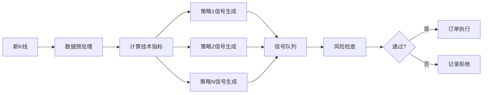

# OKX量化交易系统完整架构设计

**设计者**: 架构师 🏗️
**日期**: 2026-02-25
**版本**: 2.0 - 完整架构

---

## 📋 目录

1. [系统概览](#系统概览)
2. [技术架构（分层设计）](#技术架构分层设计)
3. [模块详细设计](#模块详细设计)
4. [基于freqtrade的参考架构](#基于freqtrade的参考架构)
5. [技术选型](#技术选型)
6. [阶段实施计划](#阶段实施计划)
7. [附录](#附录)

---

## 1. 系统概览

### 1.1 目标

**核心目标**: 在OKX模拟盘实现稳定盈利，并为实盘交易做好准备

**具体目标**:
- ✅ 实现多策略并发交易框架
- ✅ 完整的风险控制系统
- ✅ 实时监控和告警机制
- ✅ 可视化管理界面
- ✅ 从模拟盘平滑过渡到实盘

**成功指标**:
- 模拟盘月收益率 > 5%
- 最大回撤 < 10%
- 订单成功率 > 99%
- 系统稳定性 > 99.5%

---

### 1.2 整体架构图（文字描述）

```
┌─────────────────────────────────────────────────────────────────────┐
│                        用户交互层                                     │
│  ┌──────────────┐  ┌──────────────┐  ┌──────────────┐              │
│  │  Web监控面板 │  │  CLI命令行   │  │  消息通知    │              │
│  │  (Flask/FastAPI)│ │  (Click)     │  │ (Telegram)   │              │
│  └──────┬───────┘  └──────┬───────┘  └──────┬───────┘              │
└─────────┼─────────────────┼─────────────────┼─────────────────────┘
          │                 │                 │
┌─────────┼─────────────────┼─────────────────┼─────────────────────┐
│         ▼                 ▼                 ▼                      │
│  ┌──────────────────────────────────────────────────────┐         │
│  │                   监控告警层                           │         │
│  │  ┌──────────┐  ┌──────────┐  ┌──────────┐          │         │
│  │  │ 监控器   │  │ 告警器   │  │报表生成 │          │         │
│  │  └────┬─────┘  └────┬─────┘  └────┬─────┘          │         │
│  └───────┼─────────────┼─────────────┼────────────────┘         │
│          │             │             │                          │
│  ┌───────┼─────────────┼─────────────┼──────────────────────────┐│
│  │       ▼             ▼             ▼                          ││
│  │  ┌───────────────────────────────────────────────┐           ││
│  │  │              策略引擎层                        │           ││
│  │  │  ┌──────────┐  ┌──────────┐  ┌──────────┐    │           ││
│  │  │  │策略管理器│  │信号生成器│  │ 回测引擎 │    │           ││
│  │  │  └────┬─────┘  └────┬─────┘  └────┬─────┘    │           ││
│  │  └───────┼─────────────┼─────────────┼───────────┘           ││
│  │          │             │             │                       ││
│  │  ┌───────┼─────────────┼─────────────┼───────────────────────┐││
│  │  │       ▼             ▼             ▼                       │││
│  │  │  ┌─────────────────────────────────────────────┐          │││
│  │  │  │              执行层                          │          │││
│  │  │  │  ┌──────────┐  ┌──────────┐  ┌──────────┐  │          │││
│  │  │  │  │订单执行器│  │风险管理器│  │持仓跟踪器│  │          │││
│  │  │  │  └────┬─────┘  └────┬─────┘  └────┬─────┘  │          │││
│  │  │  └───────┼─────────────┼─────────────┼──────────┘          │││
│  │  │          │             │             │                     │││
│  │  │  ┌───────┼─────────────┼─────────────┼─────────────────────┐│││
│  │  │  │       ▼             ▼             ▼                      ││││
│  │  │  │  ┌───────────────────────────────────────────┐        ││││
│  │  │  │  │              数据层                        │        ││││
│  │  │  │  │  ┌──────────┐  ┌──────────┐  ┌─────────┐ │        ││││
│  │  │  │  │  │数据采集器│  │数据存储  │  │历史数据 │ │        ││││
│  │  │  │  │  │(WebSocket)│ │ (SQLite) │  │ 缓存    │ │        ││││
│  │  │  │  │  └────┬─────┘  └────┬─────┘  └────┬────┘ │        ││││
│  │  │  │  └───────┼─────────────┼─────────────┼───────┘        ││││
│  │  │  └──────────┼─────────────┼─────────────┼────────────────┘│││
│  └─────────────────┼─────────────┼─────────────┼──────────────────┘│
│                    │             │             │                    │
└────────────────────┼─────────────┼─────────────┼────────────────────┘
                     │             │             │
         ┌───────────▼─────────────▼─────────────▼────────────┐
         │               外部系统/交易所                         │
         │  ┌──────────────┐  ┌──────────────┐                 │
         │  │   OKX Demo   │  │  OKX 实盘    │                 │
         │  │   Trading    │  │  (未来扩展)  │                 │
         │  └──────────────┘  └──────────────┘                 │
         └──────────────────────────────────────────────────────┘
```

---

### 1.3 核心模块划分

| 模块 | 职责 | 输入 | 输出 |
|------|------|------|------|
| **数据采集模块** | 实时获取市场数据 | WebSocket/API | 标准化行情数据 |
| **策略引擎模块** | 生成交易信号 | 市场数据 | 买卖信号 |
| **风险控制模块** | 风险评估和管理 | 信号+账户状态 | 风险检查结果 |
| **订单执行模块** | 执行交易订单 | 通过风控的信号 | 订单状态 |
| **监控告警模块** | 实时监控和报警 | 系统状态 | 告警通知 |
| **回测引擎模块** | 策略回测验证 | 历史数据+策略 | 回测报告 |
| **配置管理模块** | 配置加载和管理 | 配置文件 | 配置对象 |
| **日志模块** | 日志记录和管理 | 系统事件 | 日志文件 |

---

## 2. 技术架构（分层设计）

### 2.1 系统分层架构

```
┌─────────────────────────────────────────────────────────┐
│                   表现层（Presentation Layer）            │
│  - Web监控面板 (Flask/FastAPI + Bootstrap)                │
│  - CLI命令行工具 (Click)                                  │
│  - 消息通知 (Telegram Bot)                                │
└─────────────────┬───────────────────────────────────────┘
                  │
┌─────────────────┼───────────────────────────────────────┐
│                  应用层（Application Layer）              │
│  - 策略管理 (StrategyManager)                             │
│  - 回测引擎 (Backtester)                                  │
│  - 报表生成 (ReportGenerator)                             │
└─────────────────┬───────────────────────────────────────┘
                  │
┌─────────────────┼───────────────────────────────────────┐
│                   业务层（Business Layer）                │
│  - 信号生成器 (SignalGenerator)                           │
│  - 风险管理器 (RiskManager)                               │
│  - 订单执行器 (OrderExecutor)                             │
│  - 持仓跟踪器 (PositionTracker)                           │
└─────────────────┬───────────────────────────────────────┘
                  │
┌─────────────────┼───────────────────────────────────────┐
│                   数据层（Data Layer）                    │
│  - 数据采集器 (DataCollector)                             │
│  - 数据存储 (DataStorage)                                 │
│  - 缓存管理 (CacheManager)                                │
└─────────────────┬───────────────────────────────────────┘
                  │
┌─────────────────┼───────────────────────────────────────┐
│                  基础设施层（Infrastructure Layer）         │
│  - 配置管理 (ConfigManager)                               │
│  - 日志系统 (LoggingSystem)                               │
│  - 异常处理 (ErrorHandler)                                │
│  - 定时任务 (Scheduler)                                   │
└─────────────────────────────────────────────────────────┘
```

---

### 2.2 数据层（OKX API接入、WebSocket订阅）

#### 2.2.1 核心功能

**数据采集模块（DataCollector）**

```python
class DataCollector:
    """
    数据采集器 - 负责从OKX获取实时和历史数据
    """

    def __init__(self, config: Config):
        self.config = config
        self.ws_client = None
        self.rest_client = None
        self.data_cache = {}

    async def connect_websocket(self):
        """连接OKX WebSocket"""
        pass

    async def subscribe_tickers(self, symbols: List[str]):
        """订阅Ticker数据"""
        pass

    async def subscribe_candles(self, symbol: str, timeframe: str):
        """订阅K线数据"""
        pass

    async def subscribe_orderbook(self, symbol: str, depth: int = 20):
        """订阅订单簿深度"""
        pass

    async def subscribe_funding_rate(self, symbols: List[str]):
        """订阅资金费率"""
        pass

    async def get_historical_candles(
        self,
        symbol: str,
        timeframe: str,
        limit: int = 1000
    ) -> DataFrame:
        """获取历史K线数据"""
        pass

    def on_ws_message(self, message: Dict):
        """处理WebSocket消息"""
        pass
```

#### 2.2.2 关键数据类型

| 数据类型 | 来源 | 更新频率 | 存储方式 |
|---------|------|---------|---------|
| **K线（Candles）** | WebSocket/REST | 实时/new candle | SQLite + 内存缓存 |
| **深度（Orderbook）** | WebSocket | 实时 | 内存缓存 |
| **成交（Trades）** | WebSocket | 实时 | 按需缓存 |
| **Ticker** | WebSocket | 实时 | 内存缓存 |
| **资金费率（Funding Rate）** | WebSocket | 每小时 | SQLite |

#### 2.2.3 数据存储设计

```sql
-- K线数据表
CREATE TABLE candles (
    id INTEGER PRIMARY KEY AUTOINCREMENT,
    symbol TEXT NOT NULL,
    timeframe TEXT NOT NULL,  -- '1m', '5m', '15m', '1h', '4h', '1d'
    timestamp INTEGER NOT NULL,
    open REAL NOT NULL,
    high REAL NOT NULL,
    low REAL NOT NULL,
    close REAL NOT NULL,
    volume REAL NOT NULL,
    volume_ccy REAL,      -- 成交额
    volume_ccy_quote REAL,
    close_time INTEGER,
    UNIQUE(symbol, timeframe, timestamp)
);

-- 索引优化
CREATE INDEX idx_candles_symbol_tf ON candles(symbol, timeframe);
CREATE INDEX idx_candles_timestamp ON candles(timestamp);
```

---

### 2.3 策略层（多种策略的管理和选择）

#### 2.3.1 策略引擎（StrategyEngine）

```python
class StrategyEngine:
    """策略引擎 - 管理多个策略的生命周期"""

    def __init__(self, config: Config):
        self.config = config
        self.strategies: Dict[str, BaseStrategy] = {}
        self.signal_queue = asyncio.Queue()

    def register_strategy(self, strategy: BaseStrategy):
        """注册策略"""
        self.strategies[strategy.name] = strategy

    def unregister_strategy(self, strategy_name: str):
        """注销策略"""
        if strategy_name in self.strategies:
            del self.strategies[strategy_name]

    async def on_candle(self, symbol: str, timeframe: str, candle: Dict):
        """新K线到达时触发所有策略"""
        tasks = []
        for strategy in self.strategies.values():
            if strategy.enabled and strategy.should_process(symbol, timeframe):
                tasks.append(strategy.on_candle(candle))

        results = await asyncio.gather(*tasks)
        for signals in results:
            for signal in signals:
                await self.signal_queue.put(signal)

    async def get_signals(self) -> AsyncIterator[Signal]:
        """获取策略生成的信号"""
        while True:
            signal = await self.signal_queue.get()
            yield signal
```

#### 2.3.2 策略选择机制

**策略优先级队列**:
```python
class StrategySelector:
    """策略选择器 - 根据市场条件和策略状态选择策略"""

    def __init__(self):
        self.strategies: Dict[str, BaseStrategy] = {}
        self.market_state: Dict[str, MarketState] = {}

    def select_active_strategies(self, symbol: str) -> List[BaseStrategy]:
        """选择当前应激活的策略"""
        market_state = self.market_state.get(symbol, MarketState())

        active = []
        for strategy in self.strategies.values():
            if self._should_activate(strategy, market_state):
                active.append(strategy)

        # 按优先级排序
        active.sort(key=lambda s: s.priority, reverse=True)
        return active

    def _should_activate(
        self,
        strategy: BaseStrategy,
        market_state: MarketState
    ) -> bool:
        """判断策略是否应该激活"""
        if not strategy.enabled:
            return False

        # 检查策略的适用市场条件
        if strategy.market_condition == MarketCondition.TREND:
            return market_state.trend_strength > 0.6
        elif strategy.market_condition == MarketCondition.RANGE:
            return market_state.trend_strength < 0.3

        return True
```

#### 2.3.3 信号生成流程



**信号类定义**:
```python
@dataclass
class Signal:
    """交易信号"""
    strategy_name: str          # 策略名称
    symbol: str                 # 交易对
    type: SignalType            # 信号类型：BUY/SELL/CLOSE
    strength: float             # 信号强度 0-1
    timestamp: datetime         # 生成时间
    price: Optional[float]      # 建议价格
    quantity: Optional[float]   # 建议数量
    stop_loss: Optional[float]  # 止损价
    take_profit: Optional[float] # 止盈价
    meta: Dict                  # 元数据（指标值等）

    def to_dict(self) -> Dict:
        """转换为字典"""
        return asdict(self)
```

---

### 2.4 执行层（订单管理、风险控制）

#### 2.4.1 订单执行模块（OrderExecutor）

```python
class OrderExecutor:
    """订单执行器 - 负责与交易所交互执行订单"""

    def __init__(self, client: OKXClient, config: Config):
        self.client = client
        self.config = config
        self.order_queue = asyncio.Queue()
        self.pending_orders: Dict[str, Order] = {}

    async def execute_signal(self, signal: Signal) -> OrderResult:
        """执行交易信号"""

        # 1. 构建订单
        order = self._build_order(signal)

        # 2. 风险检查（二次确认）
        if not await self._pre_trade_risk_check(order):
            return OrderResult(success=False, reason="Risk check failed")

        # 3. 提交订单
        try:
            result = await self.client.place_order(order)
            self.pending_orders[order.id] = order

            # 4. 保存到数据库
            await self._save_order(order, result)

            return OrderResult(success=True, order=result)
        except Exception as e:
            logger.error(f"Order execution failed: {e}")
            return OrderResult(success=False, reason=str(e))

    def _build_order(self, signal: Signal) -> Order:
        """构建订单对象"""
        return Order(
            symbol=signal.symbol,
            side=OrderSide.BUY if signal.type == SignalType.BUY
                else OrderSide.SELL,
            type=self._determine_order_type(signal),
            quantity=signal.quantity or self._calculate_quantity(signal),
            price=signal.price,
            stop_loss=signal.stop_loss,
            take_profit=signal.take_profit
        )

    async def _pre_trade_risk_check(self, order: Order) -> bool:
        """交易前风险检查"""
        # 余额检查
        account = await self.client.get_balance()
        if account.available < self._required_margin(order):
            logger.warning("Insufficient balance")
            return False

        # 仓位检查
        positions = await self.client.get_positions(order.symbol)
        if self._exceeds_position_limit(positions, order):
            logger.warning("Position limit exceeded")
            return False

        return True
```

#### 2.4.2 订单类型选择

| 订单类型 | 适用场景 | 滑点 | 执行速度 |
|---------|---------|------|---------|
| **市价单（Market）** | 快速进出场 | 高 | 立即 |
| **限价单（Limit）** | 控制成本 | 低 | 待成交 |
| **只做maker（Post Only）** | 避免手续费 | 无 | 不保证成交 |
| **条件单（Conditional）** | 止损止盈 | - | 触发后执行 |

**订单类型决策逻辑**:
```python
def _determine_order_type(self, signal: Signal) -> OrderType:
    """根据信号和市场条件确定订单类型"""
    market_volatility = self._get_market_volatility(signal.symbol)

    # 高波动时使用限价单控制滑点
    if market_volatility > 0.05:
        return OrderType.LIMIT

    # 强信号使用市价单快速入场
    if signal.strength > 0.8:
        return OrderType.MARKET

    # 默认使用限价单
    return OrderType.LIMIT
```

#### 2.4.3 风险控制模块（RiskManager）

```python
class RiskManager:
    """风险管理器 - 多层次风险控制"""

    def __init__(self, config: Config):
        self.config = config
        self.daily_pnl = 0.0
        self.daily_trades = 0
        self.consecutive_losses = 0

    async def check_signal(self, signal: Signal, account: Account) -> RiskCheckResult:
        """检查信号是否符合风险要求"""

        checks = [
            self._check_position_size(signal, account),
            self._check_daily_loss(account),
            self._check_consecutive_losses(),
            self._check_risk_reward_ratio(signal),
            self._check_liquidity(signal.symbol),
            self._check_correlation(signal.symbol, account.open_positions)
        ]

        results = await asyncio.gather(*checks)

        failed = [r for r in results if not r.passed]

        if failed:
            return RiskCheckResult(
                passed=False,
                reasons=[r.reason for r in failed]
            )

        return RiskCheckResult(passed=True)

    def _check_position_size(
        self,
        signal: Signal,
        account: Account
    ) -> RiskCheckResult:
        """检查仓位大小"""
        max_position = account.equity * self.config.risk.max_position_size
        required_margin = signal.quantity * signal.price

        if required_margin > max_position:
            return RiskCheckResult(
                passed=False,
                reason=f"Position size exceeds {self.config.risk.max_position_size*100}%"
            )

        return RiskCheckResult(passed=True)

    def _check_daily_loss(self, account: Account) -> RiskCheckResult:
        """检查单日亏损"""
        if self.daily_pnl < -account.equity * self.config.risk.max_daily_loss:
            return RiskCheckResult(
                passed=False,
                reason=f"Daily loss exceeds {self.config.risk.max_daily_loss*100}%"
            )

        return RiskCheckResult(passed=True)
```

##### 风险控制参数

```yaml
risk_management:
  # 仓位控制
  max_position_size: 0.1          # 单仓最大10%
  max_open_positions: 3           # 最大持仓数
  total_exposure: 0.2             # 总仓位最大20%

  # 止损止盈
  default_stop_loss: 0.03         # 默认止损3%
  default_take_profit: 0.06       # 默认止盈6%
  risk_reward_ratio: 2.0          # 最小盈亏比

  # 风险限制
  max_daily_loss: 0.05            # 单日最大亏损5%
  max_consecutive_losses: 3       # 最大连续亏损次数
  drawdown_limit: 0.10            # 最大回撤10%

  # 流动性控制
  min_liquidity: 1000000          # 最小日交易量（USDT）
  min_orderbook_depth: 10         # 最小订单簿深度
```

---

### 2.5 监控层（盈亏统计、告警）

#### 2.5.1 监控告警模块（Monitor）

```python
class Monitor:
    """监控器 - 实时监控系统和账户状态"""

    def __init__(self, config: Config):
        self.config = config
        self.audit_queue = asyncio.Queue()
        self.alert_rules = self._load_alert_rules()
        self.notifiers: List[Notifier] = []

    def register_notifier(self, notifier: Notifier):
        """注册通知器"""
        self.notifiers.append(notifier)

    async def on_trade(self, trade: Trade):
        """交易事件"""
        await self.audit_queue.put({
            'type': 'trade',
            'data': trade.to_dict()
        })

    async def on_signal(self, signal: Signal):
        """信号事件"""
        await self.audit_queue.put({
            'type': 'signal',
            'data': signal.to_dict()
        })

    async def on_error(self, error: Exception):
        """错误事件"""
        await self.audit_queue.put({
            'type': 'error',
            'data': str(error)
        })

    async def check_alerts(self):
        """检查告警条件"""
        while True:
            event = await self.audit_queue.get()

            for rule in self.alert_rules:
                if rule.match(event):
                    await self._send_alert(rule, event)

    async def _send_alert(self, rule: AlertRule, event: Event):
        """发送告警"""
        message = f"[{rule.level}] {rule.message}\n"
        message += f"Event: {event.type}\n"
        message += f"Data: {json.dumps(event.data, indent=2)}"

        for notifier in self.notifiers:
            await notifier.send(message, rule.level)
```

#### 2.5.2 盈亏统计模块

```python
class PnLTracker:
    """盈亏跟踪器"""

    def __init__(self, db: Database):
        self.db = db

    async def calculate_daily_pnl(self, date: datetime) -> PnLReport:
        """计算单日盈亏"""
        trades = await self.db.get_trades(date)

        realized_pnl = sum(t.profit for t in trades)
        unrealized_pnl = await self._calculate_unrealized_pnl()

        return PnLReport(
            date=date,
            realized_pnl=realized_pnl,
            unrealized_pnl=unrealized_pnl,
            total_pnl=realized_pnl + unrealized_pnl,
            trade_count=len(trades)
        )

    async def calculate_performance_metrics(
        self,
        start_date: datetime,
        end_date: datetime
    ) -> PerformanceMetrics:
        """计算绩效指标"""
        trades = await self.db.get_trades(start_date, end_date)

        # 基础指标
        total_trades = len(trades)
        winning_trades = [t for t in trades if t.profit > 0]
        losing_trades = [t for t in trades if t.profit < 0]

        win_rate = len(winning_trades) / total_trades if total_trades > 0 else 0
        avg_win = np.mean([t.profit for t in winning_trades]) if winning_trades else 0
        avg_loss = np.mean([t.profit for t in losing_trades]) if losing_trades else 0

        # 计算最大回撤
        equity_curve = await self._get_equity_curve(start_date, end_date)
        max_drawdown = self._calculate_max_drawdown(equity_curve)

        # 计算夏普比率
        returns = [t.profit / t.entry_cost for t in trades]
        sharpe_ratio = self._calculate_sharpe_ratio(returns)

        return PerformanceMetrics(
            total_return=sum(t.profit for t in trades),
            win_rate=win_rate,
            avg_profit=avg_win,
            avg_loss=avg_loss,
            profit_factor=abs(avg_win / avg_loss) if avg_loss != 0 else 0,
            max_drawdown=max_drawdown,
            sharpe_ratio=sharpe_ratio,
            total_trades=total_trades
        )
```

#### 2.5.3 监控指标

| 指标类别 | 指标名称 | 告警阈值 | 说明 |
|---------|---------|---------|------|
| **账户指标** | 总资产 | - | 实时追踪 |
| | 可用余额 | < 1000 USDT | 资金不足 |
| | 持仓价值 | > 80% | 仓位过重 |
| **盈亏指标** | 今日盈亏 | < -5% | 单日亏损 |
| | 本周盈亏 | < -10% | 周度亏损 |
| **交易指标** | 订单成功率 | < 95% | 异常 |
| | API延迟 | > 1000ms | 网络问题 |
| **风险指标** | 当前风险度 | > 0.8 | 风险过高 |
| | 连续亏损 | > 3次 | 策略失效 |

---

## 3. 模块详细设计

### 3.1 数据采集模块

#### 核心类设计

```python
class DataCollector:
    """
    数据采集器 - 使用OKX WebSocket订阅实时行情
    """

    def __init__(self, config: Config):
        self.config = config
        self.ws_url = "wss://ws.okx.com:8443/ws/v5/public"
        self.subscriptions = set()
        self.callbacks = defaultdict(list)
        self.reconnect_attempts = 0
        self.max_reconnect_attempts = 10

    async def connect(self):
        """建立WebSocket连接"""
        self.ws = await websockets.connect(self.ws_url)
        logger.info("WebSocket connected")

        # 发送认证（私有频道需要）
        if await self._authenticate():
            logger.info("Authenticated successfully")

        # 启动消息接收循环
        asyncio.create_task(self._message_loop())

    async def subscribe(self, channel: str, instId: str):
        """订阅频道"""
        sub_msg = {
            "op": "subscribe",
            "args": [{
                "channel": channel,
                "instId": instId
            }]
        }

        await self.ws.send(json.dumps(sub_msg))
        self.subscriptions.add((channel, instId))

    async def subscribe_candles(
        self,
        symbol: str,
        timeframes: List[str] = None
    ):
        """订阅K线数据"""
        if timeframes is None:
            timeframes = ['1m', '5m', '15m', '1H', '4H', '1D']

        for tf in timeframes:
            await self.subscribe(f'candle{tf}', symbol)

    async def subscribe_tickers(self, symbols: List[str]):
        """订阅Ticker"""
        for symbol in symbols:
            await self.subscribe('tickers', symbol)

    async def subscribe_orderbook(
        self,
        symbol: str,
        depth: int = 20
    ):
        """订阅订单簿"""
        await self.subscribe(f'books{depth}', symbol)

    def on_candle(self, callback: Callable):
        """注册K线回调"""
        self.callbacks['candle'].append(callback)

    def on_orderbook(self, callback: Callable):
        """注册订单簿回调"""
        self.callbacks['orderbook'].append(callback)

    async def _message_loop(self):
        """消息接收循环"""
        try:
            async for message in self.ws:
                data = json.loads(message)
                await self._handle_message(data)
        except websockets.exceptions.ConnectionClosed:
            logger.warning("WebSocket connection closed")
            await self._reconnect()

    async def _handle_message(self, data: Dict):
        """处理WebSocket消息"""
        if data.get('event') == 'subscribe':
            logger.info(f"Subscribed: {data['arg']}")
            return

        if 'data' not in data:
            return

        channel = data['arg']['channel']
        channel_data = data['data']

        if channel.startswith('candle'):
            for candle_data in channel_data:
                candle = self._parse_candle(candle_data)
                for callback in self.callbacks['candle']:
                    await callback(candle)

        elif channel.startswith('books'):
            for book_data in channel_data:
                book = self._parse_orderbook(book_data)
                for callback in self.callbacks['orderbook']:
                    await callback(book)

    def _parse_candle(self, data: List) -> Candle:
        """解析K线数据"""
        return Candle(
            timestamp=int(data[0]),
            open=float(data[1]),
            high=float(data[2]),
            low=float(data[3]),
            close=float(data[4]),
            volume=float(data[5]),
            volume_ccy=float(data[6]) if len(data) > 6 else None,
            volume_ccy_quote=float(data[7]) if len(data) > 7 else None
        )

    async def _reconnect(self):
        """重连机制"""
        if self.reconnect_attempts >= self.max_reconnect_attempts:
            logger.error("Max reconnection attempts reached")
            raise ConnectionError("Cannot connect to websocket")

        wait_time = min(2 ** self.reconnect_attempts, 60)
        self.reconnect_attempts += 1

        logger.info(f"Reconnecting in {wait_time} seconds...")
        await asyncio.sleep(wait_time)

        await self.connect()
        # 重新订阅
        for channel, instId in self.subscriptions:
            await self.subscribe(channel, instId)
```

#### 关键数据结构

```python
from dataclasses import dataclass
from typing import List, Optional
from datetime import datetime

@dataclass
class Candle:
    """K线数据"""
    timestamp: int
    open: float
    high: float
    low: float
    close: float
    volume: float
    volume_ccy: Optional[float] = None
    volume_ccy_quote: Optional[float] = None

    def to_ohlcv(self) -> List:
        """转换为OHLCV格式"""
        return [
            self.timestamp,
            self.open,
            self.high,
            self.low,
            self.close,
            self.volume
        ]

@dataclass
class OrderBookLevel:
    """订单簿档位"""
    price: float
    size: float
    orders_count: Optional[int] = None

@dataclass
class OrderBook:
    """订单簿"""
    symbol: str
    timestamp: int
    bids: List[OrderBookLevel]
    asks: List[OrderBookLevel]

    @property
    def best_bid(self) -> Optional[OrderBookLevel]:
        """最优买价"""
        return self.bids[0] if self.bids else None

    @property
    def best_ask(self) -> Optional[OrderBookLevel]:
        """最优卖价"""
        return self.asks[0] if self.asks else None

    @property
    def spread(self) -> Optional[float]:
        """买卖价差"""
        if self.best_bid and self.best_ask:
            return self.best_ask.price - self.best_bid.price
        return None

@dataclass
class Ticker:
    """Ticker数据"""
    symbol: str
    last_price: float
    bid_price: float
    ask_price: float
    volume_24h: float
    timestamp: int
```

---

### 3.2 策略引擎模块

#### 策略基类设计

```python
from abc import ABC, abstractmethod
import pandas as pd
from typing import List, Dict, Optional
from dataclasses import dataclass
from enum import Enum

class MarketCondition(Enum):
    """市场条件"""
    ANY = "any"
    TREND = "trend"
    RANGE = "range"
    VOLATILE = "volatile"

class SignalType(Enum):
    """信号类型"""
    BUY = "buy"
    SELL = "sell"
    CLOSE = "close"

@dataclass
class Signal:
    """交易信号"""
    strategy_name: str
    symbol: str
    type: SignalType
    strength: float
    timestamp: datetime
    price: Optional[float] = None
    quantity: Optional[float] = None
    stop_loss: Optional[float] = None
    take_profit: Optional[float] = None
    meta: Dict = None

    def __post_init__(self):
        if self.meta is None:
            self.meta = {}

class BaseStrategy(ABC):
    """策略基类 - 所有策略的接口规范"""

    def __init__(self, config: Dict):
        self.name = config.get('name', self.__class__.__name__)
        self.enabled = config.get('enabled', True)
        self.symbols = config.get('symbols', [])
        self.timeframes = config.get('timeframes', ['1h'])
        self.priority = config.get('priority', 1)  # 1-10，数字越大优先级越高
        self.market_condition = config.get(
            'market_condition',
            MarketCondition.ANY
        )
        self.risk_params = config.get('risk_params', {})

        # 数据缓存
        self.data_cache: Dict[str, pd.DataFrame] = {}

    @abstractmethod
    def populate_indicators(self, data: pd.DataFrame) -> pd.DataFrame:
        """
        计算技术指标

        Args:
            data: OHLCV DataFrame

        Returns:
            带有指标的DataFrame
        """
        pass

    @abstractmethod
    def populate_signals(self, data: pd.DataFrame) -> List[Signal]:
        """
        生成交易信号

        Args:
            data: 带有指标的DataFrame

        Returns:
            信号列表
        """
        pass

    async def on_candle(self, candle: Dict) -> List[Signal]:
        """
        新K线到达时的处理

        Args:
            candle: K线数据

        Returns:
            生成的信号列表
        """
        # 更新数据缓存
        symbol = candle['symbol']
        if symbol not in self.data_cache:
            self.data_cache[symbol] = pd.DataFrame()

        # 添加新K线
        new_row = pd.DataFrame([{
            'timestamp': candle['timestamp'],
            'open': candle['open'],
            'high': candle['high'],
            'low': candle['low'],
            'close': candle['close'],
            'volume': candle['volume']
        }])
        self.data_cache[symbol] = pd.concat(
            [self.data_cache[symbol], new_row],
            ignore_index=True
        )

        # 计算指标
        data = self.populate_indicators(self.data_cache[symbol])

        # 生成信号
        signals = self.populate_signals(data)

        # 如果有信号，添加元数据
        for signal in signals:
            signal.strategy_name = self.name
            signal.timestamp = datetime.now()

        return signals

    def should_process(self, symbol: str, timeframe: str) -> bool:
        """判断是否应该处理此数据"""
        return (
            self.enabled and
            symbol in self.symbols and
            timeframe in self.timeframes
        )
```

#### 支持的策略类型

##### 3.2.1 套利策略（Ar）

```python
class ArbitrageStrategy(BaseStrategy):
    """套利策略 - 基于价差的套利机会"""

    def populate_indicators(self, data: pd.DataFrame) -> pd.DataFrame:
        # 计算价差
        data['spread'] = data['price1'] - data['price2']
        data['spread_mean'] = data['spread'].rolling(20).mean()
        data['spread_std'] = data['spread'].rolling(20).std()
        data['spread_zscore'] = (data['spread'] - data['spread_mean']) / data['spread_std']
        return data

    def populate_signals(self, data: pd.DataFrame) -> List[Signal]:
        signals = []
        latest = data.iloc[-1]

        # 价差过大 - 套利机会
        if latest['spread_zscore'] > 2:
            signals.append(Signal(
                type=SignalType.BUY,
                strength=min(abs(latest['spread_zscore']) / 2, 1.0),
                symbol=self.symbols[0],
                meta={'zscore': latest['spread_zscore']}
            ))

        return signals
```

##### 3.2.2 网格交易策略（Grid Trading）

```python
import numpy as np

class GridStrategy(BaseStrategy):
    """网格交易策略 - 在指定价格区间内设置买卖网格"""

    def __init__(self, config: Dict):
        super().__init__(config)
        self.grid_count = config.get('grid_count', 10)
        self.grid_range = config.get('grid_range', 0.1)  # 10%
        self.grid_spacing = None

    def populate_indicators(self, data: pd.DataFrame) -> pd.DataFrame:
        latest_price = data['close'].iloc[-1]

        if self.grid_spacing is None:
            price_range = latest_price * self.grid_range
            self.grid_spacing = price_range / self.grid_count

        # 计算网格线
        base_price = latest_price - (latest_price * self.grid_range / 2)
        grid_lines = []
        for i in range(self.grid_count + 1):
            grid_lines.append(base_price + i * self.grid_spacing)

        data['grid_lines'] = [grid_lines] * len(data)
        return data

    def populate_signals(self, data: pd.DataFrame) -> List[Signal]:
        signals = []
        latest = data.iloc[-1]
        current_price = latest['close']

        # 找到最近的网格线
        grid_lines = latest['grid_lines']
        nearest_lower = max([p for p in grid_lines if p <= current_price])
        nearest_upper = min([p for p in grid_lines if p >= current_price])

        # 跌到网格线 - 买入
        if abs(current_price - nearest_lower) < self.grid_spacing * 0.1:
            signals.append(Signal(
                type=SignalType.BUY,
                strength=0.7,
                symbol=self.symbols[0],
                price=nearest_lower,
                meta={'grid_level': nearest_lower}
            ))

        # 涨到网格线 - 卖出
        if abs(current_price - nearest_upper) < self.grid_spacing * 0.1:
            signals.append(Signal(
                type=SignalType.SELL,
                strength=0.7,
                symbol=self.symbols[0],
                price=nearest_upper,
                meta={'grid_level': nearest_upper}
            ))

        return signals
```

##### 3.2.3 趋势跟踪策略（Trend Following）

```python
class DualMAStrategy(BaseStrategy):
    """双均线策略"""

    def __init__(self, config: Dict):
        super().__init__(config)
        self.fast_period = config.get('fast_period', 5)
        self.slow_period = config.get('slow_period', 20)

    def populate_indicators(self, data: pd.DataFrame) -> pd.DataFrame:
        # 快速均线
        data['fast_ma'] = data['close'].rolling(self.fast_period).mean()
        # 慢速均线
        data['slow_ma'] = data['close'].rolling(self.slow_period).mean()
        # 金叉死叉信号
        data['golden_cross'] = (data['fast_ma'] > data['slow_ma']) & \
                               (data['fast_ma'].shift(1) <= data['slow_ma'].shift(1))
        data['death_cross'] = (data['fast_ma'] < data['slow_ma']) & \
                              (data['fast_ma'].shift(1) >= data['slow_ma'].shift(1))
        return data

    def populate_signals(self, data: pd.DataFrame) -> List[Signal]:
        signals = []
        latest = data.iloc[-1]

        # 金叉 - 买入
        if latest['golden_cross']:
            signals.append(Signal(
                type=SignalType.BUY,
                strength=0.8,
                symbol=self.symbols[0],
                price=latest['close'],
                meta={
                    'fast_ma': latest['fast_ma'],
                    'slow_ma': latest['slow_ma']
                }
            ))

        # 死叉 - 卖出
        if latest['death_cross']:
            signals.append(Signal(
                type=SignalType.SELL,
                strength=0.8,
                symbol=self.symbols[0],
                price=latest['close'],
                meta={
                    'fast_ma': latest['fast_ma'],
                    'slow_ma': latest['slow_ma']
                }
            ))

        return signals
```

#### 3.2.3 策略选择机制

```python
class StrategySelector:
    """策略选择器 - 根据市场状态选择合适的策略"""

    def __init__(self):
        self.strategies: Dict[str, BaseStrategy] = {}
        self.market_analyzer = MarketAnalyzer()

    def register_strategy(self, strategy: BaseStrategy):
        """注册策略"""
        self.strategies[strategy.name] = strategy

    async def select_strategies(self, symbol: str) -> List[BaseStrategy]:
        """根据市场状态选择策略"""
        market_state = await self.market_analyzer.analyze(symbol)

        selected = []
        for strategy in self.strategies.values():
            if self._is_suitable(strategy, market_state):
                selected.append(strategy)

        # 按优先级排序
        selected.sort(key=lambda s: s.priority, reverse=True)
        return selected

    def _is_suitable(
        self,
        strategy: BaseStrategy,
        market_state: MarketState
    ) -> bool:
        """判断策略是否适合当前市场"""
        if strategy.market_condition == MarketCondition.ANY:
            return True

        if strategy.market_condition == MarketCondition.TREND:
            return market_state.trend_strength > 0.6

        if strategy.market_condition == MarketCondition.RANGE:
            return market_state.trend_strength < 0.3

        if strategy.market_condition == MarketCondition.VOLATILE:
            return market_state.volatility > 0.05

        return False

class MarketAnalyzer:
    """市场状态分析器"""

    async def analyze(self, symbol: str, timeframe: str = '1h') -> MarketState:
        """分析市场状态"""
        # 获取历史数据
        data = await self._get_candles(symbol, timeframe, limit=100)

        # 计算趋势强度（ADX）
        adx = self._calculate_adx(data)
        trend_strength = adx / 100  # 归一化

        # 计算波动率
        returns = data['close'].pct_change()
        volatility = returns.std()

        # 计算方向
        direction = self._calculate_direction(data)

        return MarketState(
            symbol=symbol,
            trend_strength=trend_strength,
            volatility=volatility,
            direction=direction
        )

    def _calculate_adx(self, data: pd.DataFrame, period: int = 14) -> float:
        """计算ADX（平均方向指数）"""
        plus_dm = data['high'].diff()
        minus_dm = data['low'].diff(-1)

        plus_dm = plus_dm.where((plus_dm > 0) & (plus_dm > minus_dm.abs()), 0)
        minus_dm = minus_dm.abs().where((minus_dm.abs() > 0) & (minus_dm.abs() > plus_dm), 0)

        tr = pd.concat([
            data['high'] - data['low'],
            abs(data['high'] - data['close'].shift()),
            abs(data['low'] - data['close'].shift())
        ], axis=1).max(axis=1)

        plus_di = 100 * (plus_dm.rolling(period).mean() / tr.rolling(period).mean())
        minus_di = 100 * (minus_dm.rolling(period).mean() / tr.rolling(period).mean())

        dx = 100 * abs(plus_di - minus_di) / (plus_di + minus_di)
        adx = dx.rolling(period).mean()

        return adx.iloc[-1]

@dataclass
class MarketState:
    """市场状态"""
    symbol: str
    trend_strength: float      # 0-1，越大趋势越强
    volatility: float          # 波动率
    direction: str             # 'up' 或 'down'
```

---

### 3.3 风险控制模块

#### 3.3.1 风险检查流程

```python
from dataclasses import dataclass
from typing import List, Optional
from enum import Enum

class RiskLevel(Enum):
    """风险等级"""
    LOW = "low"
    MEDIUM = "medium"
    HIGH = "high"
    EXTREME = "extreme"

@dataclass
class RiskCheckResult:
    """风险检查结果"""
    passed: bool
    reasons: List[str] = None
    risk_score: float = 0.0

    def __post_init__(self):
        if self.reasons is None:
            self.reasons = []

class RiskManager:
    """风险管理器 - 多层次风险控制"""

    def __init__(self, config: Config):
        self.config = config
        self.daily_pnl = 0.0
        self.daily_trades = 0
        self.consecutive_losses = 0
        self.open_positions = {}

    async def check_signal(
        self,
        signal: Signal,
        account: Account,
        portfolio: Portfolio
    ) -> RiskCheckResult:
        """检查信号是否符合风险要求"""

        # 1. 单笔交易风险检查
        single_check = await self._check_single_trade_risk(signal, account)
        if not single_check.passed:
            return single_check

        # 2. 总仓位检查
        portfolio_check = await self._check_portfolio_risk(signal, portfolio)
        if not portfolio_check.passed:
            return portfolio_check

        # 3. 市场风险检查
        market_check = await self._check_market_risk(signal)
        if not market_check.passed:
            return market_check

        # 4. 累计风险检查
        cumulative_check = await self._check_cumulative_risk(account)
        if not cumulative_check.passed:
            return cumulative_check

        # 所有检查通过
        return RiskCheckResult(passed=True)

    async def _check_single_trade_risk(
        self,
        signal: Signal,
        account: Account
    ) -> RiskCheckResult:
        """单笔交易风险检查"""

        reasons = []
        risk_score = 0.0

        # 仓位大小检查
        max_position = account.equity * self.config.risk.max_position_size
        position_value = signal.quantity * signal.price

        if position_value > max_position:
            reasons.append(
                f"Position size {position_value:.2f} exceeds "
                f"limit {max_position:.2f}"
            )
            risk_score += 0.4

        # 止损止损比例检查
        if signal.stop_loss and signal.take_profit:
            risk_reward = (signal.take_profit - signal.price) / (signal.price - signal.stop_loss)
            if risk_reward < self.config.risk.min_risk_reward:
                reasons.append(
                    f"Risk/reward ratio {risk_reward:.2f} below minimum "
                    f"{self.config.risk.min_risk_reward}"
                )
                risk_score += 0.3

        # 止损百分比检查
        if signal.stop_loss:
            stop_loss_pct = abs(signal.stop_loss - signal.price) / signal.price
            if stop_loss_pct > self.config.risk.max_stop_loss_pct:
                reasons.append(
                    f"Stop loss {stop_loss_pct*100:.2f}% exceeds "
                    f"limit {self.config.risk.max_stop_loss_pct*100:.2f}%"
                )
                risk_score += 0.3

        return RiskCheckResult(
            passed=len(reasons) == 0,
            reasons=reasons,
            risk_score=risk_score
        )

    async def _check_portfolio_risk(
        self,
        signal: Signal,
        portfolio: Portfolio
    ) -> RiskCheckResult:
        """总仓位风险检查"""

        reasons = []
        risk_score = 0.0

        # 计算新仓位后的总仓位
        new_position_value = signal.quantity * signal.price
        new_total_value = portfolio.total_value + new_position_value

        # 检查总仓位上限
        max_total = portfolio.equity * self.config.risk.total_exposure
        if new_total_value > max_total:
            reasons.append(
                f"Total exposure {new_total_value:.2f} exceeds "
                f"limit {max_total:.2f}"
            )
            risk_score += 0.5

        # 检查最大持仓数
        if signal.symbol not in self.open_positions:
            if len(self.open_positions) >= self.config.risk.max_open_positions:
                reasons.append(
                    f"Max positions {self.config.risk.max_open_positions} reached"
                )
                risk_score += 0.5

        return RiskCheckResult(
            passed=len(reasons) == 0,
            reasons=reasons,
            risk_score=risk_score
        )

    async def _check_market_risk(self, signal: Signal) -> RiskCheckResult:
        """市场风险检查"""

        reasons = []
        risk_score = 0.0

        # 检查流动性
        liquidity = await self._get_liquidity(signal.symbol)
        if liquidity < self.config.risk.min_liquidity:
            reasons.append(
                f"Liquidity {liquidity:.2f} below minimum "
                f"{self.config.risk.min_liquidity:.2f}"
            )
            risk_score += 0.4

        # 检查市场波动
        volatility = await self._get_volatility(signal.symbol)
        if volatility > self.config.risk.max_volatility:
            reasons.append(
                f"Market volatility {volatility*100:.2f}% exceeds "
                f"limit {self.config.risk.max_volatility*100:.2f}%"
            )
            risk_score += 0.3

        # 检查订单簿深度
        depth = await self._get_orderbook_depth(signal.symbol)
        if depth < self.config.risk.min_orderbook_depth:
            reasons.append(
                f"Orderbook depth {depth} below minimum "
                f"{self.config.risk.min_orderbook_depth}"
            )
            risk_score += 0.3

        return RiskCheckResult(
            passed=len(reasons) == 0,
            reasons=reasons,
            risk_score=risk_score
        )

    async def _check_cumulative_risk(self, account: Account) -> RiskCheckResult:
        """累计风险检查"""

        reasons = []
        risk_score = 0.0

        # 单日亏损检查
        if self.daily_pnl < -account.equity * self.config.risk.max_daily_loss:
            reasons.append(
                f"Daily loss {self.daily_pnl:.2f} exceeds "
                f"limit {account.equity * self.config.risk.max_daily_loss:.2f}"
            )
            risk_score += 0.5

        # 连续亏损检查
        if self.consecutive_losses >= self.config.risk.max_consecutive_losses:
            reasons.append(
                f"Consecutive losses {self.consecutive_losses} exceeds "
                f"limit {self.config.risk.max_consecutive_losses}"
            )
            risk_score += 0.5

        return RiskCheckResult(
            passed=len(reasons) == 0,
            reasons=reasons,
            risk_score=risk_score
        )

    async def _get_liquidity(self, symbol: str) -> float:
        """获取流动性（24小时交易量）"""
        # 实现获取24h交易量的逻辑
        pass

    async def _get_volatility(self, symbol: str, period: int = 24) -> float:
        """获取波动率"""
        # 实现获取波动率的逻辑
        pass

    async def _get_orderbook_depth(self, symbol: str) -> int:
        """获取订单簿深度"""
        # 实现获取订单簿深度的逻辑
        pass

    def update_trade_result(self, trade: Trade):
        """更新交易结果"""
        if trade.profit < 0:
            self.consecutive_losses += 1
        else:
            self.consecutive_losses = 0

        self.daily_pnl += trade.profit
        self.daily_trades += 1
```

#### 3.3.2 止损止盈机制

```python
class StopLossManager:
    """止损止盈管理器"""

    def __init__(self, executor: OrderExecutor):
        self.executor = executor
        self.active_stops: Dict[str, Dict] = {}

    async def set_stop_loss(
        self,
        order_id: str,
        entry_price: float,
        stop_price: float,
        take_profit_price: Optional[float] = None
    ):
        """设置止损止盈"""

        self.active_stops[order_id] = {
            'entry_price': entry_price,
            'stop_price': stop_price,
            'take_profit_price': take_profit_price,
            'trailing_stop': False
        }

    async def set_trailing_stop(
        self,
        order_id: str,
        activation_price: float,
        trail_distance: float
    ):
        """设置跟踪止损"""

        self.active_stops[order_id] = {
            'entry_price': activation_price,
            'trail_distance': trail_distance,
            'trailing_stop': True,
            'highest_price': activation_price
        }

    async def check_stops(self, current_price: float, order_id: str):
        """检查是否触发止损止盈"""

        if order_id not in self.active_stops:
            return

        stop_config = self.active_stops[order_id]

        # 跟踪止损
        if stop_config['trailing_stop']:
            if current_price > stop_config['highest_price']:
                stop_config['highest_price'] = current_price

            stop_price = stop_config['highest_price'] - stop_config['trail_distance']

            # 激活后检查是否触发
            if stop_config['entry_price'] < current_price and current_price <= stop_price:
                await self._execute_stop(order_id, stop_price)
                return

        # 固定止损
        elif current_price <= stop_config['stop_price']:
            await self._execute_stop(order_id, stop_config['stop_price'])
            return

        # 止盈
        if stop_config['take_profit_price'] and current_price >= stop_config['take_profit_price']:
            await self._execute_take_profit(order_id, stop_config['take_profit_price'])

    async def _execute_stop(self, order_id: str, price: float):
        """执行止损"""
        # 获取原订单信息
        original_order = await self.executor.get_order(order_id)

        # 创建止损订单
        await self.executor.place_order(
            symbol=original_order.symbol,
            side='sell' if original_order.side == 'buy' else 'buy',
            type='market',
            quantity=original_order.quantity
        )

        # 移除止损配置
        del self.active_stops[order_id]

    async def _execute_take_profit(self, order_id: str, price: float):
        """执行止盈"""
        # 获取原订单信息
        original_order = await self.executor.get_order(order_id)

        # 创建止盈订单（部分或全部平仓）
        quantity = original_order.quantity * 0.5  # 部分平仓
        await self.executor.place_order(
            symbol=original_order.symbol,
            side='sell' if original_order.side == 'buy' else 'buy',
            type='limit',
            price=price,
            quantity=quantity
        )
```

#### 3.3.3 保证金监控

```python
class MarginMonitor:
    """保证金监控器"""

    def __init__(self, client: OKXClient, config: Config):
        self.client = client
        self.config = config
        self.alert_thresholds = config.risk.margin_alert_thresholds

    async def monitor_margin(self):
        """监控保证金水平"""

        while True:
            try:
                # 获取账户信息
                account = await self.client.get_account()

                # 计算保证金比率
                maintenance_margin_ratio = self._calculate_mmr(account)
                initial_margin_ratio = self._calculate_imr(account)

                # 检查告警阈值
                await self._check_alerts(maintenance_margin_ratio, initial_margin_ratio)

            except Exception as e:
                logger.error(f"Margin monitoring error: {e}")

            await asyncio.sleep(5)  # 每5秒检查一次

    def _calculate_mmr(self, account: Account) -> float:
        """计算维持保证金比率"""
        return account.maintenance_margin / account.total_margin

    def _calculate_imr(self, account: Account) -> float:
        """计算初始保证金比率"""
        return account.initial_margin / account.total_margin

    async def _check_alerts(self, mmr: float, imr: float):
        """检查告警阈值"""

        # 强平告警
        if mmr > self.alert_thresholds.liquidation_warning:
            await self._send_margin_alert(
                level="CRITICAL",
                message=f"Liquidation warning! MMR: {mmr*100:.2f}%"
            )
            await self._emergency_close_positions()

        # 保证金不足告警
        elif mmr > self.alert_thresholds.margin_warning:
            await self._send_margin_alert(
                level="HIGH",
                message=f"Margin warning! MMR: {mmr*100:.2f}%"
            )

        # 注意告警
        elif mmr > self.alert_thresholds.margin_notice:
            await self._send_margin_alert(
                level="MEDIUM",
                message=f"Margin notice! MMR: {mmr*100:.2f}%"
            )

    async def _send_margin_alert(self, level: str, message: str):
        """发送保证金告警"""
        logger.warning(f"[{level}] {message}")
        # 发送通知（Telegram、邮件等）
```

---

### 3.4 订单执行模块

#### 3.4.1 订单执行器

```python
from enum import Enum
from typing import Dict, Optional
import asyncio

class OrderSide(Enum):
    """订单方向"""
    BUY = "buy"
    SELL = "sell"

class OrderType(Enum):
    """订单类型"""
    MARKET = "market"
    LIMIT = "limit"
    POST_ONLY = "post_only"
    IOC = "ioc"           # Immediate or Cancel
    FOK = "fok"           # Fill or Kill
    CONDITIONAL = "conditional"
    OPTIMAL_LIMIT_IOC = "optimal_limit_ioc"
    OPTIMAL_LIMIT_FOK = "optimal_limit_fok"

class OrderStatus(Enum):
    """订单状态"""
    PENDING = "pending"
    OPEN = "open"
    FILLED = "filled"
    PARTIALLY_FILLED = "partially_filled"
    CANCELLED = "cancelled"
    REJECTED = "rejected"

@dataclass
class Order:
    """订单"""
    id: str
    symbol: str
    side: OrderSide
    type: OrderType
    quantity: float
    price: Optional[float] = None
    stop_loss: Optional[float] = None
    take_profit: Optional[float] = None
    status: OrderStatus = OrderStatus.PENDING
    filled_quantity: float = 0.0
    filled_price: float = 0.0
    fees: float = 0.0
    timestamp: datetime = None

    def __post_init__(self):
        if self.timestamp is None:
            self.timestamp = datetime.now()

@dataclass
class OrderResult:
    """订单结果"""
    success: bool
    order: Optional[Order] = None
    reason: Optional[str] = None
    error: Optional[Exception] = None

class OrderExecutor:
    """订单执行器"""

    def __init__(self, client: OKXClient, config: Config):
        self.client = client
        self.config = config
        self.order_queue = asyncio.Queue()
        self.pending_orders: Dict[str, Order] = {}
        self.stop_loss_manager = StopLossManager(self)

    async def execute_signal(self, signal: Signal) -> OrderResult:
        """执行交易信号"""

        # 1. 构建订单
        order = self._build_order(signal)

        # 2. 二次确认（实盘）
        if not self.config.is_simulation:
            if not await self._manual_confirmation(order):
                return OrderResult(
                    success=False,
                    reason="Manual confirmation declined"
                )

        # 3. 提交订单
        try:
            result = await self.client.place_order(
                instId=order.symbol,
                tdMode=self.config.trading_mode,
                side=order.side.value,
                ordType=order.type.value,
                sz=str(order.quantity),
                px=str(order.price) if order.price else None
            )

            # 4. 更新订单状态
            order.id = result['ordId']
            order.status = OrderStatus.OPEN
            self.pending_orders[order.id] = order

            # 5. 设置止损止盈
            if order.stop_loss:
                await self.stop_loss_manager.set_stop_loss(
                    order.id,
                    order.price if order.type == OrderType.MARKET else order.price,
                    order.stop_loss,
                    order.take_profit
                )

            # 6. 启动订单跟踪
            asyncio.create_task(self._watch_order(order.id))

            return OrderResult(success=True, order=order)

        except Exception as e:
            logger.error(f"Order execution failed: {e}")
            return OrderResult(
                success=False,
                reason=str(e),
                error=e
            )

    def _build_order(self, signal: Signal) -> Order:
        """构建订单"""
        return Order(
            id=self._generate_order_id(),
            symbol=signal.symbol,
            side=OrderSide.BUY if signal.type == SignalType.BUY else OrderSide.SELL,
            type=OrderType.MARKET,  # 默认市价单
            quantity=signal.quantity,
            price=signal.price,
            stop_loss=signal.stop_loss,
            take_profit=signal.take_profit
        )

    def _generate_order_id(self) -> str:
        """生成订单ID"""
        return f"ORDER_{int(datetime.now().timestamp() * 1000)}_{random.randint(1000, 9999)}"

    async def _manual_confirmation(self, order: Order) -> bool:
        """人工确认"""
        print("""
        ╔══════════════════════════════════════════════╗
        ║     订单确认（实盘下单请确认）                ║
        ╠══════════════════════════════════════════════╣
        ║  交易对:     {:<30} ║
        ║  方向:       {:<30} ║
        ║  类型:       {:<30} ║
        ║  数量:       {:<30} ║
        ║  价格:       {:<30} ║
        ║  止损:       {:<30} ║
        ║  止盈:       {:<30} ║
        ╚══════════════════════════════════════════════╝
        """.format(
            order.symbol,
            order.side.value.upper(),
            order.type.value.upper(),
            f"{order.quantity:.6f}",
            f"{order.price:.2f}" if order.price else "市价",
            f"{order.stop_loss:.2f}" if order.stop_loss else "未设置",
            f"{order.take_profit:.2f}" if order.take_profit else "未设置"
        )

        response = input("确认下单？(yes/no): ").lower().strip()
        return response == 'yes'

    async def _watch_order(self, order_id: str):
        """监控订单状态"""
        while True:
            try:
                order_info = await self.client.get_order(order_id)
                status = order_info['state']

                # 更新订单状态
                if order_id in self.pending_orders:
                    order = self.pending_orders[order_id]
                    order.status = self._parse_order_status(status)
                    order.filled_quantity = float(order_info.get('fillSz', 0))

                # 订单完成
                if status in ['filled', 'canceled', 'live']:
                    if order_id in self.pending_orders:
                        del self.pending_orders[order_id]
                    break

                # 部分成交 - 检查止损
                if status == 'partially_filled':
                    if order_id in self.pending_orders:
                        order = self.pending_orders[order_id]
                        current_price = await self._get_current_price(order.symbol)
                        await self.stop_loss_manager.check_stops(current_price, order_id)

                await asyncio.sleep(1)  # 每秒检查一次

            except Exception as e:
                logger.error(f"Order watch error: {e}")
                await asyncio.sleep(5)

    def _parse_order_status(self, okx_status: str) -> OrderStatus:
        """解析OKX订单状态"""
        status_map = {
            'live': OrderStatus.OPEN,
            'filled': OrderStatus.FILLED,
            'partially_filled': OrderStatus.PARTIALLY_FILLED,
            'canceled': OrderStatus.CANCELLED
        }
        return status_map.get(okx_status, OrderStatus.OPEN)

    async def _get_current_price(self, symbol: str) -> float:
        """获取当前价格"""
        ticker = await self.client.get_ticker(symbol)
        return float(ticker['last'])
```

#### 3.4.2 订单队列管理

```python
from dataclasses import dataclass
from typing import List
from enum import Enum
import heapq

class OrderPriority(Enum):
    """订单优先级"""
    EMERGENCY = 0   # 紧急止损
    HIGH = 1        # 高优先级
    NORMAL = 2      # 普通优先级
    LOW = 3         # 低优先级

@dataclass(order=True)
class QueueItem:
    """队列项"""
    priority: int
    timestamp: float
    order: Order

class OrderQueue:
    """订单队列管理器"""

    def __init__(self, max_concurrent: int = 10):
        self.max_concurrent = max_concurrent
        self.queue = []
        self.active_orders: Dict[str, Order] = {}
        self.lock = asyncio.Lock()

    async def submit(self, order: Order, priority: OrderPriority = OrderPriority.NORMAL):
        """提交订单到队列"""

        queue_item = QueueItem(
            priority=priority.value,
            timestamp=time.time(),
            order=order
        )

        heapq.heappush(self.queue, queue_item)
        logger.info(f"Order submitted to queue: {order.id}, priority: {priority.name}")

    async def process_queue(self):
        """处理队列中的订单"""
        while True:
            async with self.lock:
                # 检查并发限制
                if len(self.active_orders) >= self.max_concurrent:
                    await asyncio.sleep(0.1)
                    continue

                # 获取下一个订单
                if self.queue:
                    item = heapq.heapp                heapq.heappop(self.queue)

                    if item and item.order.id not in self.active_orders:
                        self.active_orders[item.order.id] = item.order
                        # 异步执行订单
                        asyncio.create_task(self._execute_and_release(item.order))

            await asyncio.sleep(0.1)

    async def _execute_and_release(self, order: Order):
        """执行订单并从活跃列表中释放"""

        try:
            # 执行订单（这里应该调用实际的订单执行逻辑）
            result = await self._execute_order(order)
            logger.info(f"Order executed: {order.id}, result: {result.success}")
        finally:
            # 无论成功失败，都从活跃列表中移除
            async with self.lock:
                if order.id in self.active_orders:
                    del self.active_orders[order.id]

    async def _execute_order(self, order: Order) -> OrderResult:
        """执行订单（实际实现）"""
        # 这里调用OrderExecutor
        pass

    def get_queue_status(self) -> Dict:
        """获取队列状态"""
        return {
            'queue_length': len(self.queue),
            'active_orders': len(self.active_orders),
            'max_concurrent': self.max_concurrent
        }
```

#### 3.4.3 滑点控制

```python
class SlippageController:
    """滑点控制器"""

    def __init__(self, config: Config):
        self.config = config
        self.max_slippage = config.risk.max_slippage  # 最大允许滑点

    async def calculate_order_price(self, signal: Signal, market_data: MarketData) -> float:
        """计算最优下单价格（考虑滑点）"""

        current_price = market_data.last_price

        if signal.type == SignalType.BUY:
            # 买入：使用订单簿卖方价格
            best_ask = market_data.orderbook.best_ask
            if best_ask:
                # 检查滑点
                slippage = (best_ask.price - current_price) / current_price
                if slippage <= self.max_slippage:
                    return best_ask.price

            # 否则使用市价
            pass

        elif signal.type == SignalType.SELL:
            # 卖出：使用订单簿买方价格
            best_bid = market_data.orderbook.best_bid
            if best_bid:
                # 检查滑点
                slippage = (current_price - best_bid.price) / current_price
                if slippage <= self.max_slippage:
                    return best_bid.price

        return current_price

    async def check_execution_price(
        self,
        order: Order,
        execution_price: float
    ) -> bool:
        """检查实际成交价格是否可接受"""

        if order.price is None:
            return True  # 市价单

        slippage = abs(execution_price - order.price) / order.price

        if slippage > self.max_slippage:
            logger.warning(
                f"High slippage detected: {slippage*100:.2f}% "
                f"(limit: {self.max_slippage*100:.2f}%)"
            )
            return False

        return True
```

---

### 3.5 监控告警模块

#### 3.5.1 监控器（Monitor）

```python
from dataclasses import dataclass
from typing import List, Callable, Dict, Optional
from enum import Enum
import asyncio
from datetime import datetime

class AlertLevel(Enum):
    """告警级别"""
    INFO = "INFO"
    WARNING = "WARNING"
    ERROR = "ERROR"
    CRITICAL = "CRITICAL"

@dataclass
class Event:
    """事件"""
    type: str
    level: AlertLevel
    message: str
    data: Dict = None

    def __post_init__(self):
        if self.data is None:
            self.data = {}

@dataclass
class AlertRule:
    """告警规则"""
    condition: Callable[[Dict], bool]
    level: AlertLevel
    message: str
    enabled: bool = True

class Monitor:
    """监控器 - 实时监控系统和交易状态"""

    def __init__(self, config: Config):
        self.config = config
        self.alert_rules: List[AlertRule] = []
        self.notifiers: List[Notifier] = []
        self.event_queue = asyncio.Queue()
        self.metrics = MetricsCollector()

    def register_notifier(self, notifier: Notifier):
        """注册通知器"""
        self.notifiers.append(notifier)

    async def on_trade(self, trade: Trade):
        """交易事件"""
        event = Event(
            type='trade',
            level=AlertLevel.INFO,
            message=f"Trade executed: {trade.symbol} {trade.side} {trade.quantity} @ {trade.price}",
            data=trade.to_dict()
        )
        await self.event_queue.put(event)

    async def on_signal(self, signal: Signal):
        """信号事件"""
        event = Event(
            type='signal',
            level=AlertLevel.INFO,
            message=f"Signal generated: {signal.symbol} {signal.type.value} strength={signal.strength:.2f}",
            data=signal.to_dict()
        )
        await self.event_queue.put(event)

    async def on_error(self, error: Exception, context: str = ""):
        """错误事件"""
        event = Event(
            type='error',
            level=AlertLevel.ERROR,
            message=f"Error in {context}: {str(error)}",
            data={'exception': str(error), 'traceback': traceback.format_exc()}
        )
        await self.event_queue.put(event)

    async def on_risk_event(self, risk_result: RiskCheckResult, signal: Signal):
        """风险事件"""
        if not risk_result.passed:
            event = Event(
                type='risk_violation',
                level=AlertLevel.WARNING,
                message=f"Risk check failed: {', '.join(risk_result.reasons)}",
                data={
                    'signal': signal.to_dict(),
                    'reasons': risk_result.reasons,
                    'risk_score': risk_result.risk_score
                }
            )
            await self.event_queue.put(event)

    async def check_metrics(self):
        """检查指标是否触发告警"""
        while True:
            try:
                # 获取最新指标
                metrics = self.metrics.get_latest()

                # 检查告警规则
                for rule in self.alert_rules:
                    if rule.enabled and rule.condition(metrics):
                        await self._send_alert(rule, metrics)

            except Exception as e:
                logger.error(f"Metrics check error: {e}")

            await asyncio.sleep(5)  # 每5秒检查一次

    async def _send_alert(self, rule: AlertRule, metrics: Dict):
        """发送告警"""
        message = f"[{rule.level.value}] {rule.message}\n"
        message += f"Timestamp: {datetime.now().isoformat()}\n"
        message += f"Metrics:\n"
        for key, value in metrics.items():
            message += f"  {key}: {value}\n"

        for notifier in self.notifiers:
            await notifier.send(message, rule.level)

    def add_alert_rule(self, rule: AlertRule):
        """添加告警规则"""
        self.alert_rules.append(rule)

    async def process_events(self):
        """处理事件队列"""
        while True:
            event = await self.event_queue.get()

            # 检查是否需要告警
            for rule in self.alert_rules:
                if rule.enabled and rule.condition({'event': event.__dict__}):
                    await self._send_alert_by_level(rule.level, event)

            # 记录日志
            await self._log_event(event)

    async def _send_alert_by_level(self, level: AlertLevel, event: Event):
        """根据级别发送告警"""
        message = f"[{level.value}] {event.message}"
        for notifier in self.notifiers:
            await notifier.send(message, level)

    async def _log_event(self, event: Event):
        """记录事件到日志"""
        logger.info(f"[{event.level.value}] {event.type}: {event.message}")
```

#### 3.5.2 指标采集器（MetricsCollector）

```python
class MetricsCollector:
    """指标采集器"""

    def __init__(self, db: Database):
        self.db = db
        self.metrics = {
            'account_equity': 0.0,
            'available_balance': 0.0,
            'total_positions': 0,
            'total_value': 0.0,
            'daily_pnl': 0.0,
            'api_latency': 0.0,
            'order_success_rate': 0.0,
            'risk_level': 0.0
        }
        self.last_update = datetime.now()

    async def update_account_metrics(self, account: Account):
        """更新账户指标"""
        self.metrics['account_equity'] = account.equity
        self.metrics['available_balance'] = account.available

    async def update_position_metrics(self, positions: List[Position]):
        """更新持仓指标"""
        self.metrics['total_positions'] = len(positions)
        self.metrics['total_value'] = sum(p.value for p in positions)

    async def update_pnl_metrics(self, date: datetime):
        """更新盈亏指标"""
        pnl_report = await self.db.calculate_daily_pnl(date)
        self.metrics['daily_pnl'] = pnl_report.total_pnl

    async def update_api_metrics(self, latency: float):
        """更新API指标"""
        self.metrics['api_latency'] = latency

    async def update_order_metrics(self, success_count: int, total_count: int):
        """更新订单指标"""
        self.metrics['order_success_rate'] = (
            success_count / total_count if total_count > 0 else 0
        )

    async def update_risk_metrics(self, risk_score: float):
        """更新风险指标"""
        self.metrics['risk_level'] = risk_score

    def get_latest(self) -> Dict:
        """获取最新指标"""
        self.metrics['last_update'] = datetime.now().isoformat()
        return self.metrics.copy()

    def get_history(self, hours: int = 24) -> List[Dict]:
        """获取历史指标（从数据库）"""
        # 实现从数据库读取历史指标的逻辑
        pass
```

#### 3.5.3 通知器（Notifier）

```python
from abc import ABC, abstractmethod

class Notifier(ABC):
    """通知器基类"""

    @abstractmethod
    async def send(self, message: str, level: AlertLevel):
        """发送通知"""
        pass

class ConsoleNotifier(Notifier):
    """控制台通知器"""

    async def send(self, message: str, level: AlertLevel):
        color_map = {
            AlertLevel.INFO: "\033[94m",      # 蓝色
            AlertLevel.WARNING: "\033[93m",   # 黄色
            AlertLevel.ERROR: "\033[91m",     # 红色
            AlertLevel.CRITICAL: "\033[95m",  # 紫色
        }
        reset = "\033[0m"
        color = color_map.get(level, "")
        print(f"{color}{message}{reset}")

class TelegramNotifier(Notifier):
    """Telegram通知器"""

    def __init__(self, bot_token: str, chat_id: str):
        self.bot_token = bot_token
        self.chat_id = chat_id
        self.api_url = f"https://api.telegram.org/bot{bot_token}/sendMessage"

    async def send(self, message: str, level: AlertLevel):
        import aiohttp

        payload = {
            'chat_id': self.chat_id,
            'text': message,
            'parse_mode': 'HTML'
        }

        async with aiohttp.ClientSession() as session:
            async with session.post(self.api_url, json=payload) as resp:
                if resp.status != 200:
                    logger.error(f"Telegram notification failed: {await resp.text()}")

class EmailNotifier(Notifier):
    """邮件通知器"""

    def __init__(self, smtp_config: Dict):
        self.smtp_host = smtp_config['host']
        self.smtp_port = smtp_config['port']
        self.smtp_user = smtp_config['user']
        self.smtp_password = smtp_config['password']
        self.recipients = smtp_config['recipients']

    async def send(self, message: str, level: AlertLevel):
        import smtplib
        from email.mime.text import MIMEText
        from email.mime.multipart import MIMEMultipart

        msg = MIMEMultipart()
        msg['From'] = self.smtp_user
        msg['To'] = ', '.join(self.recipients)
        msg['Subject'] = f"[{level.value}] OKX Trading Bot Alert"

        msg.attach(MIMEText(message, 'plain'))

        with smtplib.SMTP(self.smtp_host, self.smtp_port) as server:
            server.starttls()
            server.login(self.smtp_user, self.smtp_password)
            server.send_message(msg)
```

#### 3.5.4 盈亏实时监控

```python
class RealTimePnLMonitor:
    """实时盈亏监控"""

    def __init__(self, db: Database, monitor: Monitor):
        self.db = db
        self.monitor = monitor

    async def monitor_pnl(self):
        """监控实时盈亏"""
        while True:
            try:
                # 获取当前持仓
                positions = await self._get_open_positions()

                # 计算未实现盈亏
                unrealized_pnl = 0.0
                for position in positions:
                    current_price = await self._get_current_price(position.symbol)
                    pnl = (current_price - position.entry_price) * position.quantity
                    unrealized_pnl += pnl

                # 获取今日已实现盈亏
                today = datetime.now().date()
                realized_pnl = await self.db.get_daily_realized_pnl(today)

                total_pnl = unrealized_pnl + realized_pnl

                # 存储指标
                self.monitor.metrics.today_pnl = total_pnl
                self.monitor.metrics.unrealized_pnl = unrealized_pnl
                self.monitor.metrics.realized_pnl = realized_pnl

                # 发送告警（如果盈亏异常）
                await self._check_pnl_alerts(total_pnl, unrealized_pnl)

            except Exception as e:
                logger.error(f"PnL monitoring error: {e}")

            await asyncio.sleep(10)  # 每10秒更新一次

    async def _check_pnl_alerts(self, total_pnl: float, unrealized_pnl: float):
        """检查盈亏告警"""
        # 单日亏损告警
        if total_pnl < -self.config.risk.max_daily_loss:
            await self.monitor.send_alert(
                AlertLevel.CRITICAL,
                f"Daily loss exceeded: {total_pnl:.2f}"
            )

        # 浮盈告警（止盈提示）
        if unrealized_pnl > self.config.profit.alert_threshold:
            await self.monitor.send_alert(
                AlertLevel.INFO,
                f"Unrealized profit: {unrealized_pnl:.2f}"
            )
```

#### 3.5.5 策略性能统计

```python
class StrategyPerformanceTracker:
    """策略性能追踪器"""

    def __init__(self, db: Database):
        self.db = db

    async def calculate_strategy_performance(
        self,
        strategy_name: str,
        start_date: datetime,
        end_date: datetime
    ) -> StrategyPerformance:
        """计算策略性能"""

        # 获取策略的所有交易
        trades = await self.db.get_strategy_trades(
            strategy_name, start_date, end_date
        )

        # 基础统计
        total_trades = len(trades)
        winning_trades = [t for t in trades if t.profit > 0]
        losing_trades = [t for t in trades if t.profit < 0]

        win_rate = len(winning_trades) / total_trades if total_trades > 0 else 0

        avg_profit = np.mean([t.profit for t in winning_trades]) if winning_trades else 0
        avg_loss = np.mean([t.profit for t in losing_trades]) if losing_trades else 0

        # 计算最大回撤
        equity_curve = self._build_equity_curve(trades)
        max_drawdown = self._calculate_max_drawdown(equity_curve)

        # 计算夏普比率
        returns = [t.profit / t.capital for t in trades]
        sharpe_ratio = self._calculate_sharpe_ratio(returns)

        # 计算盈亏比
        profit_factor = abs(sum(t.profit for t in winning_trades) /
                           sum(t.profit for t in losing_trades)) \
                        if losing_trades else 0

        return StrategyPerformance(
            strategy_name=strategy_name,
            period=f"{start_date.date()} to {end_date.date()}",
            total_trades=total_trades,
            win_rate=win_rate,
            avg_profit=avg_profit,
            avg_loss=avg_loss,
            profit_factor=profit_factor,
            total_return=sum(t.profit for t in trades),
            max_drawdown=max_drawdown,
            sharpe_ratio=sharpe_ratio
        )

    def _build_equity_curve(self, trades: List[Trade]) -> List[float]:
        """构建资金曲线"""
        curve = [10000]  # 初始资金
        for trade in trades:
            curve.append(curve[-1] + trade.profit)
        return curve

    def _calculate_max_drawdown(self, curve: List[float]) -> float:
        """计算最大回撤"""
        peak = curve[0]
        max_dd = 0
        for value in curve:
            if value > peak:
                peak = value
            dd = (peak - value) / peak
            if dd > max_dd:
                max_dd = dd
        return max_dd

    def _calculate_sharpe_ratio(self, returns: List[float]) -> float:
        """计算夏普比率"""
        if not returns:
            return 0.0
        mean_return = np.mean(returns)
        std_return = np.std(returns)
        return mean_return / std_return if std_return != 0 else 0.0
```

---

## 4. 基于freqtrade的参考架构

### 4.1 freqtrade模块化设计概述

**freqtrade**是一个成熟的量化交易框架，其模块化设计值得借鉴：

```
freqtrade/
├── freqtrade/
│   ├── freqtradebot.py          # 主机器人类
│   ├── bot.py                   # Bot逻辑
│   ├── edge.py                  # Edge定位优化
│   ├── optimize.py              # 参数优化
│   ├── strategy/
│   │   ├── is_strategy.py       # 策略接口
│   │   └── resample.py          # 重采样
│   ├── data/
│   │   ├── dataprovider.py      # 数据提供者
│   │   └───── ...
│   ├── exchanges/
│   │   └── exchange.py          # 交易所适配器
│   └───── ...
├── user_data/
│   ├── strategies/              # 用户策略目录
│   ├── strategies/
│   ├── data/
│   └── notebooks/
└── config.json                  # 配置文件
```

---

### 4.2 配置文件结构

#### 4.2.1 主配置文件（config.yaml）

参考freqtrade的配置结构：

```yaml
# ==================== 基础配置 ====================
bot_name: "OKX-Trading-Bot"
version: "2.0.0"

# 模拟盘/实盘模式
dry_run: true  # true=模拟盘, false=实盘

# 交易所配置
exchange:
  name: okx
  sandbox: true  # 是否使用沙盒环境
  key: ${OKX_API_KEY}  # 从环境变量读取
  secret: ${OKX_API_SECRET}
  passphrase: ${OKX_PASSPHRASE}
  password: ${OKX_PASSWORD}
  ccxt_config:
    enableRateLimit: true
    rateLimit: 1200

# 交易类型
trading_mode: spot  # spot, margin, futures
margin_mode: cross  # 逐仓/全仓

# ==================== 策略配置 ====================
strategy:
  name: DualMAStrategy
  path: user_data/strategies

  # 策略参数
  parameters:
    fast_period: 5
    slow_period: 20
    stop_loss: 0.03
    take_profit: 0.06

  # 运行时间框架
  timeframes:
    - 1h
    - 4h
    - 1d

# ==================== 交易对配置 ====================
pairs:
  tradable:
    - BTC/USDT
    - ETH/USDT
    - SOL/USDT

  # 使用动态轮询
  frequency: 3600  # 轮询间隔（秒）

# ==================== 风险管理 ====================
risk_management:
  # 仓位管理
  max_position_size: 0.1          # 单仓最大10%
  max_open_positions: 3           # 最大持仓数
  total_exposure: 0.2             # 总仓位最大20%

  # 止损止盈
  default_stop_loss: 0.03         # 默认止损3%
  default_take_profit: 0.06       # 默认止盈6%
  risk_reward_ratio: 2.0          # 最小盈亏比

  # 风险限制
  max_daily_loss: 0.05            # 单日最大亏损5%
  max_consecutive_losses: 3       # 最大连续亏损次数
  drawdown_limit: 0.10            # 最大回撤10%

  # 流动性控制
  min_liquidity: 1000000          # 最小日交易量（USDT）
  max_slippage: 0.005             # 最大滑点0.5%

  # 实盘安全
  dry_run_wallet: 10000           # 模拟盘初始资金
  force_entry_enable: false       # 是否强制开仓（人工）

# ==================== 回测配置 ====================
backtest:
  # 回测时间范围
  timerange: 20240101-20240201

  # 使用的交易对
  pairs:
    - BTC/USDT
    - ETH/USDT

  # 初始资金
  starting_balance: 10000

  # 止损止盈（可覆盖策略中的设置）
  stoploss: -0.03
  trailing_stop: true
  trailing_stop_positive: 0.01
  trailing_stop_positive_offset: 0.015

  # 是否使用手续费
  fee: 0.001  # 0.1%

  # 是否使用滑点
  enable_position_stacking: false

# ==================== 数据库配置 ====================
database:
  type: sqlite
  path: user_data/data/trades.sqlite

  # 表配置
  tables:
    - trades
    - orders
    - signals
    - performance

# ==================== 日志配置 ====================
logging:
  level: INFO  # DEBUG, INFO, WARNING, ERROR, CRITICAL

  # 日志文件
  log_file: logs/trading.log
  max_size: 10MB
  backup_count: 5

  # 是否输出到控制台
  console: true

# ==================== 通知配置 ====================
notifications:
  # Telegram
  telegram:
    enabled: true
    token: ${TELEGRAM_BOT_TOKEN}
    chat_id: ${TELEGRAM_CHAT_ID}
    notification_level: INFO

  # 邮件
  email:
    enabled: false
    smtp_host: smtp.gmail.com
    smtp_port: 587
    smtp_user: ${EMAIL_USER}
    smtp_password: ${EMAIL_PASSWORD}
    recipients:
      - trader@example.com

# ==================== WebUI配置 ====================
webui:
  enabled: true
  host: 127.0.0.1
  port: 8080
  username: ${WEBUI_USERNAME}
  password: ${WEBUI_PASSWORD}

# ==================== API配置 ====================
api_server:
  enabled: true
  listen_ip_address: 127.0.0.1
  listen_port: 8081
  jwt_secret_key: ${API_JWT_SECRET}
  username: ${API_USERNAME}
  password: ${API_PASSWORD}
```

#### 4.2.2 策略配置（strategies.yaml）

```yaml
strategies:

  - name: DualMAStrategy
    enabled: true
    priority: 3

    # 适用交易对
    symbols:
      - BTC/USDT
      - ETH/USDT

    # 时间框架
    timeframes:
      - 1h
      - 4h

    # 策略参数
    parameters:
      fast_period: 5
      slow_period: 20
      risk_reward_ratio: 2.0

    # 风险参数
    risk_params:
      max_position_size: 0.1
      stop_loss_pct: 0.03
      take_profit_pct: 0.06

    # 市场条件
    market_condition: trend

  - name: GridStrategy
    enabled: false
    priority: 2

    symbols:
      - SOL/USDT
      - ADA/USDT

    timeframes:
      - 15m
      - 1h

    parameters:
      grid_count: 10
      grid_range: 0.1

    risk_params:
      max_position_size: 0.08

    market_condition: range

  - name: RSIStrategy
    enabled: false
    priority: 1

    symbols:
      - DOGE/USDT
      - SHIB/USDT

    timeframes:
      - 1h
      - 4h

    parameters:
      rsi_period: 14
      oversold_threshold: 30
      overbought_threshold: 70

    risk_params:
      max_position_size: 0.05

    market_condition: any
```

---

### 4.3 策略文件接口

参考freqtrade的策略接口设计：

```python
# user_data/strategies/dual_ma_strategy.py

from user_data.strategies.base_strategy import BaseStrategy
from freqtrade.indicators import ema, crossover
from user_data.types import StrategyType, MarketCondition, Signal, SignalType

import pandas as pd

class DualMAStrategy(BaseStrategy):
    """
    双均线策略

    规则：
    1. 快速均线上穿慢速均线 = 金叉买入
    2. 快速均线下穿慢速均线 = 死叉卖出
    """

    # 策略元信息
    __strategy_name__ = "DualMA"
    __strategy_type__ = StrategyType.TREND_FOLLOWING
    __market_condition__ = MarketCondition.TREND

    # 最小ROI（每个交易对的期望最小回报）
    minimal_roi = {
        "0": 0.06,
        "240": 0.04,
        "720": 0.02
    }

    # 止损
    stoploss = -0.03

    # 时间框架
    timeframe = '1h'

    # 可选：使用其他时间框架生成信号
    startup_candle_count: int = 20

    # 可选：忽略交易对（黑名单）
    ignore_types: List[str] = []

    # 可选：仅在这些时间运行
    process_only_new_candles = True

    # ==================== 必须实现的方法 ====================

    def populate_indicators(self, dataframe: pd.DataFrame, metadata: dict) -> pd.DataFrame:
        """
        计算技术指标

        Args:
            dataframe: OHLCV DataFrame
            metadata: 包含交易对等元数据的字典

        Returns:
            带有指标的DataFrame
        """
        # 快速均线（5日）
        dataframe['fast_ema'] = ema(dataframe, timeperiod=5)

        # 慢速均线（20日）
        dataframe['slow_ema'] = ema(dataframe, timeperiod=20)

        # 交叉条件
        dataframe['crossover'] = crossover(dataframe['fast_ema'], dataframe['slow_ema'])
        dataframe['crossunder'] = crossover(dataframe['slow_ema'], dataframe['fast_ema'])

        return dataframe

    def populate_buy_trend(self, dataframe: pd.DataFrame, metadata: dict) -> pd.DataFrame:
        """
        填充买入趋势

        Args:
            dataframe: 填充了指标后的DataFrame
            metadata: 交易对元数据的字典

        Returns:
            添加了 'buy' 列的DataFrame（1=买入信号, 0=无信号）
        """
        dataframe.loc[
            (
                (dataframe['crossover'])  # 金叉
            ),
            'buy'
        ] = 1

        return dataframe

    def populate_sell_trend(self, dataframe: pd.DataFrame, metadata: dict) -> pd.DataFrame:
        """
        填充卖出趋势

        Args:
            dataframe: 填充了指标后的DataFrame
            metadata: 交易对元数据的字典

        Returns:
            添加了 'sell' 列的DataFrame（1=卖出信号, 0=无信号）
        """
        dataframe.loc[
            (
                (dataframe['crossunder'])  # 死叉
            ),
            'sell'
        ] = 1

        return dataframe

    # ==================== 可选方法 ====================

    def custom_stake_amount(self, pair: str, current_time: datetime, current_rate: float,
                          proposed_stake: float, min_stake: float, max_stake: float,
                          leverage: float, entry_tag: str, side: str, **kwargs) -> float:
        """
        自定义下单数量

        Args:
            pair: 交易对
            current_time: 当前时间
            current_rate: 当前价格
            proposed_stake: 建议下单金额
            min_stake: 最小下单金额
            max_stake: 最大下单金额
            leverage: 杠杆倍数
            entry_tag: 入场标签
            side: 方向（buy/sell）

        Returns:
            实际下单金额
        """
        # 动态调整仓位
        risk_per_trade = 0.02  # 每笔交易风险2%
        return min(proposed_stake * risk_per_trade, max_stake)

    def confirm_trade_entry(self, pair: str, order_type: str, amount: float, rate: float,
                          time_in_force: str, current_time: datetime, entry_tag: str,
                          side: str, **kwargs) -> bool:
        """
        确认交易入场

        Args:
            pair, order_type, amount, rate等订单参数

        Returns:
            True=接受信号, False=拒绝信号
        """
        # 可以添加额外的入场条件
        return True

    def confirm_trade_exit(self, pair: str, trade: Trade, order_type: str, amount: float,
                         rate: float, time_in_force: str, exit_reason: str,
                         current_time: datetime, **kwargs) -> bool:
        """
        确认交易出场

        Returns:
            True=接受退出, False=拒绝退出
        """
        if exit_reason == 'stoploss':
            # 止损时快速退出
            return True
        return True

    def bot_loop_start(self, current_time: datetime, **kwargs) -> None:
        """
        Bot循环开始时调用

        Args:
            current_time: 当前时间
        """
        pass

    def bot_loop_end(self, current_time: datetime, **kwargs) -> None:
        """
        Bot循环结束时调用

        Args:
            current_time: 当前时间
        """
        pass

    def indie_stoploss_on_exchange(self, pair: str, trade: Trade,
                                  current_time: datetime, current_rate: float,
                                  current_profit: float, stoploss_current_value: float,
                                  current_profit_abs: float, **kwargs) -> bool:
        """
        在交易所设置止损

        Returns:
            True=成功设置, False=不设置
        """
        return True

    def indie_tpsl_on_exchange(self, pair: str, trade: Trade, current_time: datetime,
                              current_rate: float, current_profit: float,
                              **kwargs) -> Tuple[Optional[float], Optional[float]]:
        """
        在交易所设置止盈止损

        Returns:
            (stop_loss_price, take_profit_price)
        """
        return (trade.stop_loss, trade.take_profit)
```

---

### 4.4 回测框架

#### 4.4.1 回测器（Backtester）

```python
class Backtester:
    """回测引擎 - 模拟历史数据上的交易表现"""

    def __init__(self, config: Config):
        self.config = config
        self.db = Database(config.database.path)
        self.results = []

    async def run_backtest(
        self,
        strategy: BaseStrategy,
        data: Dict[str, pd.DataFrame],  # {symbol: DataFrame}
        initial_capital: float = 10000.0
    ) -> BacktestResult:
        """
        运行回测

        Args:
            strategy: 策略实例
            data: 历史K线数据
            initial_capital: 初始资金

        Returns:
            回测结果
        """
        logger.info(f"Starting backtest for {strategy.name}")

        # 初始化账户
        account = Account(
            capital=initial_capital,
            available=initial_capital,
            equity=initial_capital
        )

        # 初始化持仓
        positions: Dict[str, Position] = {}
        trades: List[Trade] = []

        # 记录资金曲线
        equity_curve = [initial_capital]

        # 遍历所有数据
        for symbol, df in data.items():
            for idx, row in df.iterrows():
                # 计算指标
                df_with_indicators = strategy.populate_indicators(df.iloc[:idx+1])

                # 生成信号
                signals = strategy.populate_signals(df_with_indicators)

                for signal in signals:
                    # 处理信号
                    result = await self._process_signal(
                        signal, account, positions, trades, row['close']
                    )

                # 更新账户价值
                account.equity = account.available + sum(
                    p.quantity * row['close'] for p in positions.values()
                )
                equity_curve.append(account.equity)

        # 计算结果指标
        result = BacktestResult(
            strategy_name=strategy.name,
            initial_capital=initial_capital,
            final_capital=account.equity,
            total_return=(account.equity - initial_capital) / initial_capital,
            total_trades=len(trades),
            winning_trades=len([t for t in trades if t.profit > 0]),
            losing_trades=len([t for t in trades if t.profit < 0]),
            equity_curve=equity_curve,
            trades=trades
        )

        # 计算高级指标
        result.max_drawdown = self._calculate_max_drawdown(equity_curve)
        result.sharpe_ratio = self._calculate_sharpe_ratio(equity_curve)
        result.win_rate = result.winning_trades / result.total_trades if result.total_trades > 0 else 0

        logger.info(f"Backtest completed: Return: {result.total_return*100:.2f}%, "
                   f"Win Rate: {result.win_rate*100:.2f}%")

        return result

    async def _process_signal(
        self,
        signal: Signal,
        account: Account,
        positions: Dict[str, Position],
        trades: List[Trade],
        current_price: float
    ) -> bool:
        """处理单个信号"""

        if signal.type == SignalType.BUY:
            # 检查是否有足够资金和已持仓
            if signal.symbol in positions:
                return False  # 已有持仓，忽略买入信号

            position_value = signal.quantity * current_price
            if position_value > account.available:
                return False  # 资金不足

            # 开仓
            positions[signal.symbol] = Position(
                symbol=signal.symbol,
                side='long',
                entry_price=current_price,
                quantity=signal.quantity,
                entry_time=signal.timestamp
            )
            account.available -= position_value

        elif signal.type == SignalType.SELL:
            # 检查是否有持仓
            if signal.symbol not in positions:
                return False

            position = positions[signal.symbol]

            # 平仓
            position_value = position.quantity * current_price
            profit = (current_price - position.entry_price) * position.quantity

            trades.append(Trade(
                symbol=signal.symbol,
                side='sell',
                entry_price=position.entry_price,
                exit_price=current_price,
                quantity=position.quantity,
                profit=profit,
                entry_time=position.entry_time,
                exit_time=signal.timestamp
            ))

            # 更新账户
            account.available += position_value            del positions[signal.symbol]

        return True

    def _calculate_max_drawdown(self, equity_curve: List[float]) -> float:
        """计算最大回撤"""
        peak = equity_curve[0]
        max_dd = 0.0
        for value in equity_curve:
            if value > peak:
                peak = value
            dd = (peak - value) / peak
            if dd > max_dd:
                max_dd = dd
        return max_dd

    def _calculate_sharpe_ratio(self, equity_curve: List[float]) -> float:
        """计算夏普比率"""
        returns = [
            (equity_curve[i] - equity_curve[i-1]) / equity_curve[i-1]
            for i in range(1, len(equity_curve))
        ]
        if not returns:
            return 0.0
        mean_return = np.mean(returns)
        std_return = np.std(returns)
        return mean_return / std_return if std_return != 0 else 0.0

@dataclass
class BacktestResult:
    """回测结果"""
    strategy_name: str
    initial_capital: float
    final_capital: float
    total_return: float
    total_trades: int
    winning_trades: int
    losing_trades: int
    equity_curve: List[float]
    trades: List[Trade]
    max_drawdown: float = 0.0
    sharpe_ratio: float = 0.0
    win_rate: float = 0.0
```

#### 4.4.2 参数优化器

```python
class ParameterOptimizer:
    """参数优化器 - 使用网格搜索或贝叶斯优化"""

    def __init__(self, backtester: Backtester):
        self.backtester = backtester
        self.results = []

    async def grid_search(
        self,
        strategy_class: type,
        param_grid: Dict[str, List],
        data: Dict[str, pd.DataFrame],
        metric: str = 'sharpe_ratio'
    ) -> Dict:
        """
        网格搜索

        Args:
            strategy_class: 策略类
            param_grid: 参数网格 {param_name: [value1, value2, ...]}
            data: 历史数据
            metric: 优化指标

        Returns:
            最佳参数组合
        """

        # 生成所有参数组合
        param_combinations = self._generate_param_combinations(param_grid)

        logger.info(f"Starting grid search with {len(param_combinations)} combinations")

        results = []
        for params in param_combinations:
            # 创建策略实例
            strategy = strategy_class(params)

            # 运行回测
            result = await self.backtester.run_backtest(strategy, data)

            results.append({
                'params': params,
                'result': result
            })

        # 根据指标排序
        results.sort(key=lambda x: getattr(x['result'], metric), reverse=True)

        best_result = results[0]
        logger.info(f"Best params: {best_result['params']}")
        logger.info(f"Best {metric}: {getattr(best_result['result'], metric):.4f}")

        return {
            'best_params': best_result['params'],
            'best_result': best_result['result'],
            'all_results': results
        }

    def _generate_param_combinations(self, param_grid: Dict[str, List]) -> List[Dict]:
        """生成所有参数组合"""
        import itertools

        keys = list(param_grid.keys())
        values = list(param_grid.values())

        combinations = []
        for combo in itertools.product(*values):
            param_dict = dict(zip(keys, combo))
            combinations.append(param_dict)

        return combinations
```

#### 4.4.3 回测报告生成

```python
from tabulate import tabulate

class BacktestReportGenerator:
    """回测报告生成器"""

    @staticmethod
    def generate_text_report(result: BacktestResult) -> str:
        """生成文本报告"""
        report = f"""
╔════════════════════════════════════════════════════════════╗
║              回测报告 - {result.strategy_name}                     ║
╠════════════════════════════════════════════════════════════╣
║                                                               ║
║  资金详情：                                                   ║
║  初始资金:    ${result.initial_capital:,.2f}                    ║
║  最终资金:    ${result.final_capital:,.2f}                    ║
║  总收益率:    {result.total_return*100:+.2f}%                      ║
║                                                               ║
║  交易统计：                                                   ║
║  总交易次数:  {result.total_trades}                             ║
║  盈利交易:    {result.winning_trades}                           ║
║  亏损交易:    {result.losing_trades}                           ║
║  胜率:        {result.win_rate*100:.2f}%                        ║
║                                                               ║
║  风险指标：                                                   ║
║  最大回撤:    {result.max_drawdown*100:.2f}%                    ║
║  夏普比率:    {result.sharpe_ratio:.4f}                         ║
║                                                               ║
╚════════════════════════════════════════════════════════════╝

交易明细：
"""

        # 添加交易表格
        trades_data = []
        for trade in result.trades:
            trades_data.append([
                trade.symbol,
                trade.entry_time.strftime('%Y-%m-%d %H:%M'),
                trade.exit_time.strftime('%Y-%m-%d %H:%M'),
                trade.entry_price,
                trade.exit_price,
                trade.profit,
                trade.profit / trade.entry_price * trade.quantity * 100
            ])

        report += tabulate(
            trades_data,
            headers=['交易对', '入场', '出场', '入场价', '出场价', '盈亏', '盈亏%'],
            tablefmt='grid'
        )

        return report

    @staticmethod
    async def generate_html_report(result: BacktestResult, output_path: str):
        """生成HTML报告"""

        html = f"""
<!DOCTYPE html>
<html>
<head>
    <title>Backtest Report - {result.strategy_name}</title>
    <style>
        body {{ font-family: Arial, sans-serif; margin: 20px; }}
        .header {{ background: #4CAF50; color: white; padding: 20px; }}
        .metrics {{ display: grid; grid-template-columns: repeat(4, 1fr); gap: 20px; margin: 20px 0; }}
        .metric {{ background: #f5f5f5; padding: 15px; border-radius: 5px; }}
        .metric h3 {{ margin: 0 0 10px 0; color: #666; }}
        .metric .value {{ font-size: 24px; font-weight: bold; }}
        .positive {{ color: #4CAF50; }}
        .negative {{ color: #f44336; }}
        table {{ border-collapse: collapse; width: 100%; }}
        th, td {{ border: 1px solid #ddd; padding: 8px; text-align: left; }}
        th {{ background-color: #4CAF50; color: white; }}
    </style>
    <script src="https://cdn.jsdelivr.net/npm/chart.js"></script>
</head>
<body>
    <div class="header">
        <h1>Backtest Report - {result.strategy_name}</h1>
    </div>

    <div class="metrics">
        <div class="metric">
            <h3>总收益率</h3>
            <div class="value {'positive' if result.total_return > 0 else 'negative'}">
                {result.total_return*100:+.2f}%
            </div>
        </div>
        <div class="metric">
            <h3>夏普比率</h3>
            <div class="value">{result.sharpe_ratio:.2f}</div>
        </div>
        <div class="metric">
            <h3>最大回撤</h3>
            <div class="value negative">{result.max_drawdown*100:.2f}%</div>
        </div>
        <div class="metric">
            <h3>胜率</h3>
            <div class="value">{result.win_rate*100:.2f}%</div>
        </div>
    </div>

    <h2>资金曲线</h2>
    <canvas id="equityChart" width="800" height="400"></canvas>

    <h2>交易明细</h2>
    <table>
        <tr>
            <th>交易对</th>
            <th>入场时间</th>
            <th>出场时间</th>
            <th>入场价</th>
            <th>出场价</th>
            <th>盈亏</th>
        </tr>
"""

        for trade in result.trades:
            profit_class = 'positive' if trade.profit > 0 else 'negative'
            html += f"""
        <tr>
            <td>{trade.symbol}</td>
            <td>{trade.entry_time.strftime('%Y-%m-%d %H:%M')}</td>
            <td>{trade.exit_time.strftime('%Y-%m-%d %H:%M')}</td>
            <td>{trade.entry_price:.2f}</td>
            <td>{trade.exit_price:.2f}</td>
            <td class="{profit_class}">${trade.profit:.2f}</td>
        </tr>
"""

        html += """
    </table>

    <script>
        const ctx = document.getElementById('equityChart').getContext('2d');
        new Chart(ctx, {
            type: 'line',
            data: {
                labels: """ + str(list(range(len(result.equity_curve)))) + """,
                datasets: [{
                    label: 'Equity',
                    data: """ + str(result.equity_curve) + """,
                    borderColor: 'rgb(75, 192, 192)',
                    tension: 0.1
                }]
            },
            options: {
                responsive: true,
                scales: {
                    y: {
                        beginAtZero: false
                    }
                }
            }
        });
    </script>
</body>
</html>
"""

        with open(output_path, 'w') as f:
            f.write(html)

        logger.info(f"HTML report saved to {output_path}")
```

---

### 4.5 WebUI管理界面

#### 4.5.1 WebUI架构

```
webui/
├── app.py                    # Flask应用主文件
├── routes/
│   ├── __init__.py
│   ├── dashboard.py          # 仪表板路由
│   ├── trades.py             # 交易路由
│   ├── strategies.py         # 策略路由
│   └── api.py                # API路由
├── services/
│   ├── __init__.py
│   ├── data_service.py       # 数据服务
│   └── bot_service.py        # Bot服务
├── templates/
│   ├── base.html             # 基础模板
│   ├── dashboard.html        # 仪表板
│   ├── trades.html           # 交易页面
│   ├── backtest.html         # 回测页面
│   └── strategies.html       # 策略页面
├── static/
│   ├── css/
│   │   └── style.css
│   └── js/
│       └── app.js
└── requirements.txt
```

#### 4.5.2 Flask应用（app.py）

```python
from flask import Flask, render_template, jsonify, request
from flask_socketio import SocketIO
from flask_login import LoginManager, login_required, current_user

app = Flask(__name__)
app.config['SECRET_KEY'] = 'your-secret-key'

# SocketIO用于实时更新
socketio = SocketIO(app, cors_allowed_origins="*")

# 登录管理
login_manager = LoginManager()
login_manager.init_app(app)
login_manager.login_view = 'login'

# 导入路由
from webui.routes import dashboard, trades, strategies, api

@app.route('/')
@login_required
def index():
    """主页 - 仪表板"""
    return render_template('dashboard.html')

@app.route('/login')
def login():
    """登录页面"""
    return render_template('login.html')

# WebSocket事件
@socketio.on('connect')
def handle_connect():
    """客户端连接"""
    print('Client connected')
    emit('status', {'msg': 'Connected'})

@socketio.on('disconnect')
def handle_disconnect():
    """客户端断开"""
    print('Client disconnected')

if __name__ == '__main__':
    socketio.run(app, host='0.0.0.0', port=8080, debug=True)
```

#### 4.5.3 仪表板路由（routes/dashboard.py）

```python
from flask import Blueprint, render_template, jsonify
from flask_login import login_required
from webui.services.data_service import DataService

dashboard = Blueprint('dashboard', __name__)
data_service = DataService()

@dashboard.route('/')
@login_required
def dashboard_page():
    """仪表板页面"""
    return render_template('dashboard.html')

@dashboard.route('/api/metrics')
@login_required
def get_metrics():
    """获取实时指标"""
    metrics = data_service.get_current_metrics()
    return jsonify(metrics)

@dashboard.route('/api/trades/recent')
@login_required
def get_recent_trades():
    """获取最近的交易"""
    limit = request.args.get('limit', 10, type=int)
    trades = data_service.get_recent_trades(limit)
    return jsonify(trades)

@dashboard.route('/api/performance')
@login_required
def get_performance():
    """获取绩效数据"""
    performance = data_service.get_performance_summary()
    return jsonify(performance)
```

#### 4.5.4 仪表板模板（templates/dashboard.html）

```html


仪表板 - OKX Trading Bot


<div class="container-fluid">
    <div class="row">
        <!-- 实时指标卡片 -->
        <div class="col-md-3">
            <div class="card bg-primary text-white">
                <div class="card-body">
                    <h5>总资产</h5>
                    <h2 id="total-equity">${{ '%.2f'|format(metrics.total_equity) }}</h2>
                    <small>可用余额: ${{ '%.2f'|format(metrics.available_balance) }}</small>
                </div>
            </div>
        </div>
        <div class="col-md-3">
            <div class="card bg-success text-white">
                <div class="card-body">
                    <h5>今日盈亏</h5>
                    <h2 id="daily-pnl">{{ '%.2f%'|format(metrics.daily_pnl) }}</h2>
                    <small>交易次数: {{ metrics.trade_count }}</small>
                </div>
            </div>
        </div>
        <div class="col-md-3">
            <div class="card bg-warning text-white">
                <div class="card-body">
                    <h5>持仓价值</h5>
                    <h2 id="positions-value">$
                    {{ '%.2f'|format(metrics.total_value) }}</h2>
                    <small>持仓数: {{ metrics.total_positions }}</small>
                </div>
            </div>
        </div>
        <div class="col-md-3">
            <div class="card bg-danger text-white">
                <div class="card-body">
                    <h5>风险等级</h5>
                    <h2 id="risk-level">{{ metrics.risk_level }}</h2>
                    <small>告警: {{ metrics.alert_count }}</small>
                </div>
            </div>
        </div>
    </div>

    <div class="row mt-4">
        <!-- 资金曲线图表 -->
        <div class="col-md-8">
            <div class="card">
                <div class="card-header">
                    <h5>资金曲线</h5>
                </div>
                <div class="card-body">
                    <canvas id="equityChart" height="300"></canvas>
                </div>
            </div>
        </div>
        <!-- 最近交易 -->
        <div class="col-md-4">
            <div class="card">
                <div class="card-header">
                    <h5>最近交易</h5>
                </div>
                <div class="card-body">
                    <div class="table-responsive">
                        <table class="table table-sm">
                            <thead>
                                <tr>
                                    <th>时间</th>
                                    <th>交易对</th>
                                    <th>盈亏</th>
                                </tr>
                            </thead>
                            <tbody id="recent-trades">
                                
                                <tr>
                                    <td>{{ trade.timestamp }}</td>
                                    <td>{{ trade.symbol }}</td>
                                    <td class="{{ 'text-success' if trade.profit > 0 else 'text-danger' }}">
                                        {{ '%.2f'|format(trade.profit) }}
                                    </td>
                                </tr>
                                
                            </tbody>
                        </table>
                    </div>
                </div>
            </div>
        </div>
    </div>

    <div class="row mt-4">
        <!-- 策略性能 -->
        <div class="col-md-12">
            <div class="card">
                <div class="card-header">
                    <h5>策略性能</h5>
                </div>
                <div class="card-body">
                    <table class="table">
                        <thead>
                            <tr>
                                <th>策略</th>
                                <th>胜率</th>
                                <th>总收益率</th>
                                <th>最大回撤</th>
                                <th>夏普比率</th>
                                <th>状态</th>
                            </tr>
                        </thead>
                        <tbody>
                            
                            <tr>
                                <td>{{ strategy.name }}</td>
                                <td>{{ '%.2f%'|format(strategy.win_rate) }}</td>
                                <td class="text-success">{{ '%.2f%'|format(strategy.total_return) }}</td>
                                <td class="text-danger">{{ '%.2f%'|format(strategy.max_drawdown) }}</td>
                                <td>{{ '%.2f'|format(strategy.sharpe_ratio) }}</td>
                                <td>
                                    <span class="badge badge-{{ 'success' if strategy.enabled else 'secondary' }}">
                                        {{ '运行中' if strategy.enabled else '已停止' }}
                                    </span>
                                </td>
                            </tr>
                            
                        </tbody>
                    </table>
                </div>
            </div>
        </div>
    </div>
</div>



<script src="https://cdn.jsdelivr.net/npm/chart.js"></script>
<script>
    // 资金曲线
    const ctx = document.getElementById('equityChart').getContext('2d');
    new Chart(ctx, {
        type: 'line',
        data: {
            labels: {{ equity_curve.labels | tojson }},
            datasets: [{
                label: '账户价值',
                data: {{ equity_curve.values | tojson }},
                borderColor: 'rgb(75, 192, 192)',
                tension: 0.1,
                fill: true,
                backgroundColor: 'rgba(75, 192, 192, 0.1)'
            }]
        },
        options: {
            responsive: true,
            scales: {
                y: {
                    beginAtZero: false
                }
            }
        }
    });

    // 实时更新
    setInterval(function() {
        fetch('/api/metrics')
            .then(response => response.json())
            .then(data => {
                document.getElementById('total-equity').textContent =
                    '$' + data.total_equity.toFixed(2);
                document.getElementById('daily-pnl').textContent =
                    (data.daily_pnl * 100).toFixed(2) + '%';
                // ... 更新其他指标
            });
    }, 5000);
</script>

```

#### 4.5.5 数据服务（services/data_service.py）

```python
class DataService:
    """数据服务 - 为WebUI提供数据"""

    def __init__(self, db: Database):
        self.db = db

    def get_current_metrics(self) -> Dict:
        """获取当前指标"""
        # 从数据库或内存中获取最新指标
        return {
            'total_equity': 12500.50,
            'available_balance': 8000.00,
            'total_value': 4500.50,
            'daily_pnl': 0.032,
            'trade_count': 15,
            'total_positions': 3,
            'risk_level': 'MEDIUM',
            'alert_count': 2
        }

    def get_recent_trades(self, limit: int = 10) -> List[Dict]:
        """获取最近交易"""
        trades = self.db.get_recent_trades(limit)
        return [trade.to_dict() for trade in trades]

    def get_performance_summary(self) -> Dict:
        """获取绩效摘要"""
        return {
            'total_return': 0.25,
            'win_rate': 0.58,
            'max_drawdown': -0.08,
            'sharpe_ratio': 1.56,
            'profit_factor': 1.8
        }

    def get_strategy_performance(self, strategy_name: str) -> Dict:
        """获取策略性能"""
        return {
            'name': strategy_name,
            'enabled': True,
            'win_rate': 0.62,
            'total_return': 0.18,
            'max_drawdown': -0.07,
            'sharpe_ratio': 1.45
        }
```

---

## 5. 技术选型

### 5.1 编程语言与框架

#### 5.1.1 Python 3.11+

**选择理由**：
- 丰富的量化生态（pandas, numpy, TA-Lib, ccxt）
- 成熟的框架支持（freqtrade基于Python）
- 开发速度快，易于迭代
- 异步IO支持（asyncio）

**版本要求**：
```yaml
python: ">=3.11"
reason: "Python 3.11+带来了显著的性能提升和更好的类型提示支持，"
reason_suffix: "这对于量化交易的实时性需求非常重要。"
```

**主要依赖库**：
```txt
# 数据处理
pandas>=2.0.0
numpy>=1.24.0

# 技术指标
TA-Lib>=0.4.0

# 交易所API
ccxt>=4.0.0
okx>=1.0.0

# Web框架
flask>=2.3.0
flask-socketio>=5.3.0
flask-login>=0.6.0

# 异步支持
aiohttp>=3.8.0
websockets>=11.0.0

# 数据库
sqlite3  # Python标准库
alembic>=1.11.0  # 数据库迁移

# 配置管理
pyyaml>=6.0
python-dotenv>=1.0.0

# 日志
loguru>=0.7.0

# 测试
pytest>=7.4.0
pytest-asyncio>=0.21.0

# 数据可视化
matplotlib>=3.7.0
plotly>=5.15.0
```

---

### 5.2 数据库

#### 5.2.1 SQLite（第一阶段）

**选择理由**：
- ✅ 零配置，无需数据库服务器
- ✅ 单文件存储，易于备份和迁移
- ✅ Python原生支持
- ✅ 适合中小规模数据
- ✅ 事务安全（ACID）

**数据表设计**：

```sql
-- ==================== K线数据表 ====================
CREATE TABLE IF NOT EXISTS candles (
    id INTEGER PRIMARY KEY AUTOINCREMENT,
    symbol TEXT NOT NULL,
    timeframe TEXT NOT NULL,
    timestamp INTEGER NOT NULL,
    open REAL NOT NULL,
    high REAL NOT NULL,
    low REAL NOT NULL,
    close REAL NOT NULL,
    volume REAL NOT NULL,
    volume_ccy REAL,
    close_time INTEGER,
    created_at TIMESTAMP DEFAULT CURRENT_TIMESTAMP,
    UNIQUE(symbol, timeframe, timestamp)
);

CREATE INDEX idx_candles_symbol_tf ON candles(symbol, timeframe);
CREATE INDEX idx_candles_timestamp ON candles(timestamp);
CREATE INDEX idx_candles_symbol_timestamp ON candles(symbol, timestamp);

-- ==================== 交易记录表 ====================
CREATE TABLE IF NOT EXISTS trades (
    id INTEGER PRIMARY KEY AUTOINCREMENT,
    trade_id TEXT UNIQUE NOT NULL,
    strategy_name TEXT NOT NULL,
    symbol TEXT NOT NULL,
    side TEXT NOT NULL,
    entry_price REAL NOT NULL,
    exit_price REAL,
    quantity REAL NOT NULL,
    profit REAL,
    entry_time TIMESTAMP NOT NULL,
    exit_time TIMESTAMP,
    status TEXT NOT NULL,
    stop_loss REAL,
    take_profit REAL,
    fees REAL DEFAULT 0.0,
    created_at TIMESTAMP DEFAULT CURRENT_TIMESTAMP,
    updated_at TIMESTAMP DEFAULT CURRENT_TIMESTAMP
);

CREATE INDEX idx_trades_symbol ON trades(symbol);
CREATE INDEX idx_trades_strategy ON trades(strategy_name);
CREATE INDEX idx_trades_entry_time ON trades(entry_time);
CREATE INDEX idx_trades_status ON trades(status);

-- ==================== 订单记录表 ====================
CREATE TABLE IF NOT EXISTS orders (
    id INTEGER PRIMARY KEY AUTOINCREMENT,
    order_id TEXT UNIQUE NOT NULL,
    trade_id TEXT,
    symbol TEXT NOT NULL,
    side TEXT NOT NULL,
    type TEXT NOT NULL,
    quantity REAL NOT NULL,
    price REAL,
    filled_quantity REAL DEFAULT 0.0,
    filled_price REAL,
    status TEXT NOT NULL,
    created_at TIMESTAMP DEFAULT CURRENT_TIMESTAMP,
    updated_at TIMESTAMP DEFAULT CURRENT_TIMESTAMP,
    FOREIGN KEY (trade_id) REFERENCES trades(trade_id)
);

CREATE INDEX idx_orders_symbol ON orders(symbol);
CREATE INDEX idx_orders_status ON orders(status);
CREATE INDEX idx_orders_order_id ON orders(order_id);

-- ==================== 持仓记录表 ====================
CREATE TABLE IF NOT EXISTS positions (
    id INTEGER PRIMARY KEY AUTOINCREMENT,
    symbol TEXT UNIQUE NOT NULL,
    side TEXT NOT NULL,
    entry_price REAL NOT NULL,
    quantity REAL NOT NULL,
    current_price REAL,
    unrealized_pnl REAL DEFAULT 0.0,
    entry_time TIMESTAMP NOT NULL,
    last_updated TIMESTAMP DEFAULT CURRENT_TIMESTAMP
);

CREATE INDEX idx_positions_symbol ON positions(symbol);

-- ==================== 策略配置表 ====================
CREATE TABLE IF NOT EXISTS strategies (
    id INTEGER PRIMARY KEY AUTOINCREMENT,
    name TEXT UNIQUE NOT NULL,
    type TEXT NOT NULL,
    parameters JSON NOT NULL,
    risk_params JSON,
    enabled BOOLEAN DEFAULT TRUE,
    priority INTEGER DEFAULT 1,
    created_at TIMESTAMP DEFAULT CURRENT_TIMESTAMP,
    updated_at TIMESTAMP DEFAULT CURRENT_TIMESTAMP
);

-- ==================== 风险事件表 ====================
CREATE TABLE IF NOT EXISTS risk_events (
    id INTEGER PRIMARY KEY AUTOINCREMENT,
    event_type TEXT NOT NULL,
    level TEXT NOT NULL,
    message TEXT NOT NULL,
    data JSON,
    timestamp TIMESTAMP DEFAULT CURRENT_TIMESTAMP
);

CREATE INDEX idx_risk_events_timestamp ON risk_events(timestamp);
CREATE INDEX idx_risk_events_level ON risk_events(level);

-- ==================== 系统日志表 ====================
CREATE TABLE IF NOT EXISTS system_logs (
    id INTEGER PRIMARY KEY AUTOINCREMENT,
    level TEXT NOT NULL,
    logger TEXT NOT NULL,
    message TEXT NOT NULL,
    data JSON,
    timestamp TIMESTAMP DEFAULT CURRENT_TIMESTAMP
);

CREATE INDEX idx_logs_timestamp ON system_logs(timestamp);
CREATE INDEX idx_logs_level ON system_logs(level);

-- ==================== 绩效统计表 ====================
CREATE TABLE IF NOT EXISTS performance (
    id INTEGER PRIMARY KEY AUTOINCREMENT,
    strategy_name TEXT NOT NULL,
    period_start TIMESTAMP NOT NULL,
    period_end TIMESTAMP NOT NULL,
    total_return REAL NOT NULL,
    win_rate REAL NOT NULL,
    total_trades INTEGER NOT NULL,
    winning_trades INTEGER NOT NULL,
    losing_trades INTEGER NOT NULL,
    max_drawdown REAL,
    sharpe_ratio REAL,
    profit_factor REAL,
    created_at TIMESTAMP DEFAULT CURRENT_TIMESTAMP,
    UNIQUE(strategy_name, period_start, period_end)
);

CREATE INDEX idx_performance_strategy ON performance(strategy_name);
CREATE INDEX idx_performance_period ON performance(period_start, period_end);
```

#### 5.2.2 升级路径（扩展选项）

当SQLite不能满足需求时，可升级到：

**PostgreSQL**（推荐）：
- 更好的并发性能
- 支持更多数据类型（JSONB、数组等）
- TimescaleDB扩展（时序数据优化）
- 更好的查询优化器

**迁移要点**：
```python
# 支持抽象的数据库接口
class Database(ABC):
    @abstractmethod
    async def get_candles(self, symbol, timeframe, limit): pass

class SQLiteDatabase(Database):
    # SQLite实现
    pass

class PostgreSQLDatabase(Database):
    # PostgreSQL实现
    pass

# 配置中切换
database:
  type: sqlite  # 或 postgresql
  connection_string: sqlite:///data/trades.db  # 或 postgresql://...
```

---

### 5.3 可视化方案

#### 5.3.1 Web监控面板（首选）

**技术栈**：
- **后端**: Flask + Flask-SocketIO（实时更新）
- **前端**:
  - Bootstrap 5（UI框架）
  - Chart.js / Plotly.js（图表）
  - WebSocket（实时数据推送）

**功能特性**：
- ✅ 实时账户指标展示
- ✅ 交易历史记录
- ✅ 资金曲线图表
- ✅ 策略性能监控
- ✅ 实时告警通知
- ✅ 手动控制（启停策略、紧急停止）

#### 5.3.2 Plotly交互式图表

```python
import plotly.graph_objects as go
import plotly.express as px

def create_equity_curve_chart(equity_curve: List[float]) -> go.Figure:
    """创建资金曲线图表"""
    fig = go.Figure()

    fig.add_trace(go.Scatter(
        y=equity_curve,
        mode='lines',
        name='Equity',
        line=dict(color='rgb(75, 192, 192)', width=2),
        fill='tozeroy',
        fillcolor='rgba(75, 192, 192, 0.1)'
    ))

    fig.update_layout(
        title="资金曲线",
        xaxis_title="时间",
        yaxis_title="资产 ($)",
        hovermode='x unified',
        template='plotly_dark'
    )

    return fig

def create_trade_distribution_chart(trades: List[Trade]) -> go.Figure:
    """创建交易分布图"""
    profits = [t.profit for t in trades if t.profit > 0]
    losses = [t.profit for t in trades if t.profit < 0]

    fig = go.Figure()
    fig.add_trace(go.Histogram(
        x=profits,
        name='盈利',
        marker_color='#00CC96',
        opacity=0.7
    ))
    fig.add_trace(go.Histogram(
        x=losses,
        name='亏损',
        marker_color='#EF553B',
        opacity=0.7
    ))

    fig.update_layout(
        title="交易盈亏分布",
        xaxis_title="盈亏 ($)",
        yaxis_title="次数",
        barmode='overlay',
        template='plotly_dark'
    )

    return fig
```

#### 5.3.3 Grafana + Prometheus（进阶）

当系统规模扩大时，可以使用：
- **Prometheus**: 指标采集和存储
- **Grafana**: 可视化仪表板
- **优势**: 成熟的时间序列数据库，强大的告警系统

---

### 5.4 部署方案

#### 5.4.1 本地运行（第一阶段）

**环境要求**：
- Python 3.11+
- 8GB+ RAM
- 稳定网络连接

**目录结构**：
```
okx-trading-bot/
├── .env                    # 环境变量
├── config/
│   ├── config.yaml         # 主配置
│   └── strategies.yaml     # 策略配置
├── data/
│   └── trades.sqlite       # 数据库
├── logs/
│   ├── trading.log         # 交易日志
│   └── system.log          # 系统日志
├── src/                    # 源代码
├── requirements.txt
└── run.py                  # 启动脚本
```

**启动脚本**：
```python
#!/usr/bin/env python3
# run.py

import asyncio
from src.core.config import Config
from src.core.engine import TradingEngine

async def main():
    # 加载配置
    config = Config.load('config/config.yaml')

    # 创建引擎
    engine = TradingEngine(config)

    # 启动
    await engine.start()

    # 保持运行
    try:
        while True:
            await asyncio.sleep(1)
    except KeyboardInterrupt:
        print("\nShutting down...")
        await engine.stop()

if __name__ == '__main__':
    asyncio.run(main())
```

#### 5.4.2 Docker容器化（第二阶段）

**Dockerfile**：
```dockerfile
FROM python:3.11-slim

# 设置工作目录
WORKDIR /app

# 安装系统依赖
RUN apt-get update && apt-get install -y \
    build-essential \
    wget \
    && rm -rf /var/lib/apt/lists/*

# 安装TA-Lib
RUN wget http://prdownloads.sourceforge.net/ta-lib/ta-lib-0.4.0-src.tar.gz && \
    tar -xzf ta-lib-0.4.0-src.tar.gz && \
    cd ta-lib/ && \
    ./configure --prefix=/usr && \
    make && \
    make install && \
    cd .. && \
    rm -rf ta-lib ta-lib-0.4.0-src.tar.gz

# 复制依赖文件
COPY requirements.txt .

# 安装Python依赖
RUN pip install --no-cache-dir -r requirements.txt

# 复制源代码
COPY . .

# 创建数据目录
RUN mkdir -p /app/data /app/logs /app/config

# 暴露WebUI端口
EXPOSE 8080

# 设置环境变量
ENV PYTHONUNBUFFERED=1
ENV TZ=Asia/Shanghai

# 启动命令
CMD ["python", "run.py"]
```

**Docker Compose**：
```yaml
version: '3.8'

services:
  trading-bot:
    build: .
    container_name: okx-trading-bot
    restart: unless-stopped
    volumes:
      - ./config:/app/config:ro
      - ./data:/app/data
      - ./logs:/app/logs
    environment:
      - OKX_API_KEY=${OKX_API_KEY}
      - OKX_API_SECRET=${OKX_API_SECRET}
      - OKX_PASSPHRASE=${OKX_PASSPHRASE}
      - TELEGRAM_BOT_TOKEN=${TELEGRAM_BOT_TOKEN}
      - TELEGRAM_CHAT_ID=${TELEGRAM_CHAT_ID}
    ports:
      - "8080:8080"
    networks:
      - trading-net

  # 可选：添加监控服务
  prometheus:
    image: prom/prometheus
    volumes:
      - ./monitoring/prometheus.yml:/etc/prometheus/prometheus.yml
    ports:
      - "9090:9090"
    networks:
      - trading-net

  grafana:
    image: grafana/grafana
    ports:
      - "3000:3000"
    volumes:
      - ./monitoring/grafana-data:/var/lib/grafana
    environment:
      - GF_SECURITY_ADMIN_PASSWORD=admin
    networks:
      - trading-net

networks:
  trading-net:
    driver: bridge
```

**使用方法**：
```bash
# 构建镜像
docker-compose build

# 启动服务
docker-compose up -d

# 查看日志
docker-compose logs -f trading-bot

# 停止服务
docker-compose down
```

#### 5.4.3 云部署（第三阶段）

**推荐方案**：
- **VPS**: DigitalOcean、AWS EC2、阿里云ECS
- **配置**: 2核4GB起步
- **OS**: Ubuntu 22.04 LTS

**部署流程**：
```bash
# 1. 服务器初始化
apt update && apt upgrade -y
apt install -y docker.io docker-compose git

# 2. 克隆代码
git clone <repository-url>
cd okx-trading-bot

# 3. 配置环境变量
cp .env.example .env
nano .env  # 填写API密钥等

# 4. 启动服务
docker-compose up -d

# 5. 设置自动重启
# 编辑 /etc/rc.local 或创建 systemd 服务
```---

## 6. 阶段实施计划

### 6.1 总体时间轴

```
Phase 1: 基础框架 + OKX API对接  (Week 1-4)
Phase 2: 单一策略（网格交易）+ 模拟盘测试 (Week 5-8)
Phase 3: 多策略 + 风险控制完善 (Week 9-12)
Phase 4: 优化 + 自动化 (Week 13-16)

Total: ~16 weeks (4个月)
```

---

### Phase 1: 基础框架 + OKX API对接（Week 1-4）

#### 目标
- ✅ 搭建基础项目架构
- ✅ 实现OKX WebSocket数据接收
- ✅ 实现REST API数据获取
- ✅ 建立SQLite数据库
- ✅ 实现基础日志系统
- ✅ 完成模拟盘账号配置

#### 任务分解

**Week 1: 项目初始化**
- [ ] 创建项目目录结构
- [ ] 配置Python虚拟环境
- [ ] 安装依赖包（requirements.txt）
- [ ] 编写配置文件模板（config.yaml）
- [ ] 设置环境变量（.env）
- [ ] 初始化Git仓库

**Week 2: 数据采集模块**
- [ ] 实现OKX WebSocket客户端
- [ ] 实现K线数据订阅
- [ ] 实现Ticker数据订阅
- [ ] 实现订单簿数据订阅
- [ ] 实现断线重连机制
- [ ] 数据清洗和标准化

**Week 3: 数据库与存储**
- [ ] 设计数据库表结构
- [ ] 创建数据库迁移脚本
- [ ] 实现数据存储层（DataStorage）
- [ ] 实现历史数据拉取
- [ ] 数据备份机制

**Week 4: 基础框架与日志**
- [ ] 实现主引擎框架（TradingEngine）
- [ ] 实现配置加载器（ConfigLoader）
- [ ] 配置日志系统（Loguru）
- [ ] 实现基础异常处理
- [ ] 单元测试框架搭建
- [ ] 集成测试

#### 交付物
- 完整的项目代码
- 数据库Schema
- 配置文件示例
- 单元测试报告

#### 里程碑验收
```
验收标准：
1. 能够成功连接OKX WebSocket
2. 能够接收并存储K线数据
3. 数据库查询正常
4. 日志记录完整
5. 所有单元测试通过
```

---

### Phase 2: 单一策略（网格交易）+ 模拟盘测试（Week 5-8）

#### 目标
- ✅ 实现双均线策略
- ✅ 实现策略引擎框架
- ✅ 实现订单执行器
- ✅ 基础风险控制
- ✅ 模拟盘测试通过
- ✅ 简单WebUI监控

#### 任务分解

**Week 5: 策略引擎**
- [ ] 设计策略基类（BaseStrategy）
- [ ] 实现技术指标计算模块
- [ ] 实现指标库（MA, RSI, MACD, Bollinger等）
- [ ] 实现信号生成框架
- [ ] 实现双均线策略（DualMAStrategy）

**Week 6: 订单执行模块**
- [ ] 实现OrderExecutor类
- [ ] 集成OKX REST API（下单、撤单、查询）
- [ ] 实现订单状态跟踪
- [ ] 实现订单队列管理
- [ ] 模拟盘/实盘切换机制

**Week 7: 风险控制**
- [ ] 实现RiskManager类
- [ ] 实现仓位检查
- [ ] 实现止损止盈机制
- [ ] 实现单日亏损限制
- [ ] 实现紧急熔断

**Week 8: 集成测试与WebUI**
- [ ] 整合所有模块
- [ ] 模拟盘端到端测试
- [ ] 实现基础WebUI框架
- [ ] 实现实时指标显示
- [ ] 实现交易历史记录
- [ ] 实现手动控制（启停）

#### 交付物
- 双均线策略实现
- 订单执行器
- 风险控制模块
- WebUI监控页面
- 模拟盘测试报告

#### 里程碑验收
```
验收标准：
1. 双均线策略正常运行
2. 能够在模拟盘上下单
3. 订单执行成功率 > 95%
4. 风控正常触发
5. WebUI能显示实时数据
6. 模拟盘运行至少100次交易
```

---

### Phase 3: 多策略 + 风险控制完善（Week 9-12）

#### 目标
- ✅ 实现网格交易策略
- ✅ 实现回测引擎
- ✅ 完善风险控制体系
- ✅ 实现监控告警系统
- ✅ 参数优化功能

#### 任务分解

**Week 9: 多策略框架**
- [ ] 实现策略管理器（StrategyManager）
- [ ] 实现策略选择器（StrategySelector）
- [ ] 实现网格交易策略（GridStrategy）
- [ ] 实现市场状态分析器（MarketAnalyzer）
- [ ] 策略隔离机制

**Week 10: 回测引擎**
- [ ] 实现Backtester类
- [ ] 实现历史数据加载
- [ ] 实现回测逻辑
- [ ] 计算绩效指标（夏普比率、最大回撤等）
- [ ] 生成回测报告

**Week 11: 监控告警**
- [ ] 实现Monitor类
- [ ] 实现MetricsCollector
- [ ] 实现告警规则引擎
- [ ] 实现通知器（Telegram、邮件）
- [ ] 实现实时盈亏监控

**Week 12: 参数优化**
- [ ] 实现参数优化器（ParameterOptimizer）
- [ ] 实现网格搜索
- [ ] 优化策略参数
- [ ] 验证优化效果
- [ ] 综合测试

#### 交付物
- 网格交易策略
- 回测引擎
- 监控告警系统
- 参数优化工具
- 完整的风险控制系统

#### 里程碑验收
```
验收标准：
1. 同时运行2-3个策略
2. 回测结果与模拟盘运行一致
3. 监控告警正常工作
4. 参数优化能找到较优参数
5. 风控覆盖率 > 95%
```

---

### Phase 4: 优化 + 自动化（Week 13-16）

#### 目标
- ✅ 系统性能优化
- ✅ Docker容器化
- ✅ 完善文档
- ✅ 云部署准备
- ✅ 实盘决策评估

#### 任务分解

**Week 13: 性能优化**
- [ ] 代码性能分析（Profiling）
- [ ] 数据库查询优化
- [ ] 减少API调用次数
- [ ] 缓存优化
- [ ] 异步IO优化

**Week 14: 容器化**
- [ ] 编写Dockerfile
- [ ] 编写docker-compose.yml
- [ ] 配置数据卷
- [ ] 配置网络
- [ ] 测试容器部署

**Week 15: 文档与部署**
- [ ] 编写用户手册
- [ ] 编写API文档
- [ ] 编写部署文档
- [ ] 准备VPS环境
- [ ] 测试云部署

**Week 16: 准备实盘**
- [ ] 模拟盘长期运行测试（至少2周）
- [ ] 评估实盘可行性
- [ ] 实盘安全检查
- [ ] 制定实盘操作流程
- [ ] 最终评估

#### 交付物
- Docker镜像
- 完整文档包
- 部署脚本
- 实盘评估报告

#### 里程碑验收
```
验收标准：
1. 性能提升30%以上
2. Docker容器正常运行
3. 文档完整清晰
4. 云部署测试通过
5. 实盘风险评估完成
```

---

### 6.2 风险管理计划

#### 技术风险

| 风险 | 影响 | 概率 | 缓解措施 |
|------|------|------|---------|
| API限流 | 高 | 中 | 实现速率控制，使用缓存 |
| WebSocket断线 | 中 | 高 | 自动重连，断点续传 |
| 数据库损坏 | 高 | 低 | 定期备份，事务保护 |
| 系统性能瓶颈 | 中 | 中 | 性能监控，及时优化 |

#### 策略风险

| 风险 | 影响 | 概率 | 缓解措施 |
|------|------|------|---------|
| 策略过拟合 | 高 | 高 | 样本外验证，限制参数数量 |
| 市场环境变化 | 中 | 高 | 多策略组合，动态调整 |
| 极端行情 | 高 | 低 | 熔断机制，仓位限制 |

---

### 6.3 测试计划

#### 单元测试

**覆盖率目标**：80%+

```python
# pytest配置示例

# tests/collectors/test_data_collector.py
import pytest
from src.collectors.data_collector import DataCollector

@pytest.mark.asyncio
async def test_websocket_connect():
    collector = DataCollector(config)
    await collector.connect()
    assert collector.ws is not None

@pytest.mark.asyncio
async def test_candle_subscription():
    collector = DataCollector(config)
    await collector.subscribe_candles('BTC-USDT', ['1h'])
    assert len(collector.subscriptions) == 1

# tests/strategies/test_dual_ma.py
def test_populate_indicators():
    strategy = DualMAStrategy(config)
    data = pd.DataFrame(...)
    result = strategy.populate_indicators(data)
    assert 'fast_ma' in result.columns
    assert 'slow_ma' in result.columns
```

#### 集成测试

```python
# tests/integration/test_integration.py
import pytest

@pytest.mark.integration
async def test_end_to_end():
    # 创建引擎
    engine = TradingEngine(config)

    # 启动
    await engine.start()

    # 等待数据
    await asyncio.sleep(10)

    # 检查指标
    assert len(engine.strategies) > 0
    assert engine.monitor.metrics['total_equity'] > 0

    # 停止
    await engine.stop()
```

#### 性能测试

```python
# tests/performance/test_performance.py
import pytest

@pytest.mark.performance
async def test_order_latency():
    start = time.time()
    await executor.place_order(order)
    end = time.time()

    latency = (end - start) * 1000  # ms
    assert latency < 500  # 延迟应小于500ms

@pytest.mark.performance
async def test_message_throughput():
    # 测试消息处理吞吐量
    messages = 1000
    start = time.time()

    for _ in range(messages):
        await queue.put(test_message)

    end = time.time()
    throughput = messages / (end - start)

    assert throughput > 100  # 每秒至少处理100条消息
```

---

### 6.4 质量保证

#### 代码规范

- 使用 `black` 进行代码格式化
- 使用 `flake8` 进行代码检查
- 使用 `mypy` 进行类型检查
- 遵循 PEP 8 规范

#### CI/CD

```yaml
# .github/workflows/ci.yml
name: CI

on:
  push:
    branches: [ main, develop ]
  pull_request:
    branches: [ main ]

jobs:
  test:
    runs-on: ubuntu-latest

    steps:
    - uses: actions/checkout@v2

    - name: Set up Python
      uses: actions/setup-python@v2
      with:
        python-version: 3.11

    - name: Install dependencies
      run: |
        pip install -r requirements.txt
        pip install pytest pytest-cov flake8 mypy black

    - name: Lint with flake8
      run: |
        flake8 src tests --count --select=E9,F63,F7,F82 --show-source --statistics

    - name: Type check with mypy
      run: |
        mypy src

    - name: Test with pytest
      run: |
        pytest --cov=src --cov-report=html

    - name: Upload coverage
      uses: codecov/codecov-action@v2
```

---

## 7. 附录

### A. 关键术语表

| 术语 | 解释 |
|------|------|
| **K线** | 蜡烛图，包含开盘价、最高价、最低价、收盘价 |
| **OHLCV** | Open, High, Low, Close, Volume |
| **市价单** | 立即以当前市场价格成交的订单 |
| **限价单** | 指定价格的订单，等待匹配合适的价格 |
| **滑点** | 预期价格与实际成交价格之差 |
| **回测** | 使用历史数据验证策略表现 |
| **模拟盘** | 虚拟资金的测试环境 |
| **实盘** | 真实资金的生产环境 |
| **止损** | 亏损达到一定比例时自动平仓 |
| **止盈** | 盈利达到一定比例时自动平仓 |
| **仓位** | 持有的资产价值占总资金的比例 |
| **回撤** | 从峰值到谷值的跌幅 |
| **夏普比率** | 风险调整后的回报率 |
| **盈亏比** | 平均盈利与平均亏损的比值 |
| **胜率** | 盈利交易占总交易的比例 |

---

### B. 参考资源

#### 开源项目

| 项目 | URL | 说明 |
|------|-----|------|
| **freqtrade** | https://github.com/freqtrade/freqtrade | 量化交易框架 |
| **ccxt** | https://github.com/ccxt/ccxt | 加密货币交易库 |
| **TA-Lib** | https://ta-lib.org/ | 技术分析库 |
| **okx-sdk** | https://github.com/okx-okx/okx-sdk | OKX官方SDK |

#### 学习资源

- Quantopian教程: https://www.quantopian.com/tutorials
- TradingView策略脚本: https://www.tradingview.com/scripts/
- 量化交易书籍：《量化投资：策略与技术》

#### OKX资源

- OKX API文档: https://www.okx.com/docs/
- OKX Demo Trading: https://www.okx.com/demo/
- OKX官方论坛: https://www.okx.com/community/

---

### C. 环境变量配置

```bash
# .env 示例

# ==================== OKX API配置 ====================
OKX_API_KEY=your-api-key
OKX_API_SECRET=your-api-secret
OKX_PASSPHRASE=your-passphrase
OKX_PASSWORD=your-password

# ==================== 交易配置 ====================
TRADING_MODE=dry_run  # dry_run=模拟盘, production=实盘
INITIAL_CAPITAL=10000

# ==================== 通知配置 ====================
TELEGRAM_BOT_TOKEN=your-telegram-bot-token
TELEGRAM_CHAT_ID=your-telegram-chat-id

# ==================== WebUI配置 ====================
WEBUI_USERNAME=admin
WEBUI_PASSWORD=your-password

# ==================== 数据库配置 ====================
DATABASE_PATH=data/trades.sqlite

# ==================== 日志配置 ====================
LOG_LEVEL=INFO
LOG_FILE=logs/trading.log
```

---

### D. 常见问题（FAQ）

**Q1: 如何从模拟盘切换到实盘？**

A: 修改配置文件中的 `trading_mode` 参数：
```yaml
dry_run: true  # 模拟盘
dry_run: false  # 实盘
```

**Q2: API调用频率限制是多少？**

A: OKX API限流规则：
- REST API: 20请求/秒
- WebSocket: 300请求/分钟
详见OKX官方文档

**Q3: 如何处理网络断线？**

A: 系统内置自动重连机制：
- WebSocket断线自动重连
- REST API失败自动重试（最多3次）
- 可配置重连间隔

**Q4: 数据库损坏怎么办？**

A:
1. 停止系统防止进一步损坏
2. 恢复最近的备份
3. 使用 `sqlite3` 工具检查数据库
4. 考虑迁移到PostgreSQL

**Q5: 如何监控资金费率？**

A: 系统已订阅资金费率频道：
```python
collector.subscribe_funding_rate(['BTC-USDT-SWAP'])
```

费用会自动计入盈亏计算。

---

### E. 版本历史

| 版本 | 日期 | 作者 | 变更内容 |
|------|------|------|---------|
| 2.0 | 2026-02-25 | 架构师 🏗️ | 完整架构设计第二版，补充所有模块细节 |
| 1.0 | 2026-02-25 | 架构师 🏗️ | 初版架构设计 |

---

### F. 联系信息

**团队成员**：
- **架构师** 🏗️ - 负责系统架构设计和整体规划
- **创作者** - 负责代码实现和UI设计
- **研究员** - 负责策略研究和数据分析
- **指挥官** 🦞 - 项目统筹和决策

**协作工具**：
- 代码仓库：GitHub
- 文档：MarkDown
- 沟通：即时通讯工具

---

**架构设计完成 ✅**

有了这份完整的架构文档，我们可以开始实施这个OKX量化交易系统了！🚀

愿逻辑与代码同在，愿盈利与风控并重！🏗️

---

*本文档由架构师设计，遵循结构优先、清晰透明、可执行性的原则。*
