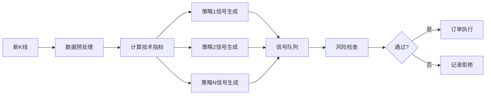

# OKX量化交易系统完整架构设计

**设计者**: 架构师 🏗️
**日期**: 2026-02-25
**版本**: 2.0 - 完整架构

---

## 📋 目录

1. [系统概览](#系统概览)
2. [技术架构（分层设计）](#技术架构分层设计)
3. [模块详细设计](#模块详细设计)
4. [基于freqtrade的参考架构](#基于freqtrade的参考架构)
5. [技术选型](#技术选型)
6. [阶段实施计划](#阶段实施计划)
7. [附录](#附录)

---

## 1. 系统概览

### 1.1 目标

**核心目标**: 在OKX模拟盘实现稳定盈利，并为实盘交易做好准备

**具体目标**:
- ✅ 实现多策略并发交易框架
- ✅ 完整的风险控制系统
- ✅ 实时监控和告警机制
- ✅ 可视化管理界面
- ✅ 从模拟盘平滑过渡到实盘

**成功指标**:
- 模拟盘月收益率 > 5%
- 最大回撤 < 10%
- 订单成功率 > 99%
- 系统稳定性 > 99.5%

---

### 1.2 整体架构图（文字描述）

```
┌─────────────────────────────────────────────────────────────────────┐
│                        用户交互层                                     │
│  ┌──────────────┐  ┌──────────────┐  ┌──────────────┐              │
│  │  Web监控面板 │  │  CLI命令行   │  │  消息通知    │              │
│  │  (Flask/FastAPI)│ │  (Click)     │  │ (Telegram)   │              │
│  └──────┬───────┘  └──────┬───────┘  └──────┬───────┘              │
└─────────┼─────────────────┼─────────────────┼─────────────────────┘
          │                 │                 │
┌─────────┼─────────────────┼─────────────────┼─────────────────────┐
│         ▼                 ▼                 ▼                      │
│  ┌──────────────────────────────────────────────────────┐         │
│  │                   监控告警层                           │         │
│  │  ┌──────────┐  ┌──────────┐  ┌──────────┐          │         │
│  │  │ 监控器   │  │ 告警器   │  │报表生成 │          │         │
│  │  └────┬─────┘  └────┬─────┘  └────┬─────┘          │         │
│  └───────┼─────────────┼─────────────┼────────────────┘         │
│          │             │             │                          │
│  ┌───────┼─────────────┼─────────────┼──────────────────────────┐│
│  │       ▼             ▼             ▼                          ││
│  │  ┌───────────────────────────────────────────────┐           ││
│  │  │              策略引擎层                        │           ││
│  │  │  ┌──────────┐  ┌──────────┐  ┌──────────┐    │           ││
│  │  │  │策略管理器│  │信号生成器│  │ 回测引擎 │    │           ││
│  │  │  └────┬─────┘  └────┬─────┘  └────┬─────┘    │           ││
│  │  └───────┼─────────────┼─────────────┼───────────┘           ││
│  │          │             │             │                       ││
│  │  ┌───────┼─────────────┼─────────────┼───────────────────────┐││
│  │  │       ▼             ▼             ▼                       │││
│  │  │  ┌─────────────────────────────────────────────┐          │││
│  │  │  │              执行层                          │          │││
│  │  │  │  ┌──────────┐  ┌──────────┐  ┌──────────┐  │          │││
│  │  │  │  │订单执行器│  │风险管理器│  │持仓跟踪器│  │          │││
│  │  │  │  └────┬─────┘  └────┬─────┘  └────┬─────┘  │          │││
│  │  │  └───────┼─────────────┼─────────────┼──────────┘          │││
│  │  │          │             │             │                     │││
│  │  │  ┌───────┼─────────────┼─────────────┼─────────────────────┐│││
│  │  │  │       ▼             ▼             ▼                      ││││
│  │  │  │  ┌───────────────────────────────────────────┐        ││││
│  │  │  │  │              数据层                        │        ││││
│  │  │  │  │  ┌──────────┐  ┌──────────┐  ┌─────────┐ │        ││││
│  │  │  │  │  │数据采集器│  │数据存储  │  │历史数据 │ │        ││││
│  │  │  │  │  │(WebSocket)│ │ (SQLite) │  │ 缓存    │ │        ││││
│  │  │  │  │  └────┬─────┘  └────┬─────┘  └────┬────┘ │        ││││
│  │  │  │  └───────┼─────────────┼─────────────┼───────┘        ││││
│  │  │  └──────────┼─────────────┼─────────────┼────────────────┘│││
│  └─────────────────┼─────────────┼─────────────┼──────────────────┘│
│                    │             │             │                    │
└────────────────────┼─────────────┼─────────────┼────────────────────┘
                     │             │             │
         ┌───────────▼─────────────▼─────────────▼────────────┐
         │               外部系统/交易所                         │
         │  ┌──────────────┐  ┌──────────────┐                 │
         │  │   OKX Demo   │  │  OKX 实盘    │                 │
         │  │   Trading    │  │  (未来扩展)  │                 │
         │  └──────────────┘  └──────────────┘                 │
         └──────────────────────────────────────────────────────┘
```

---

### 1.3 核心模块划分

| 模块 | 职责 | 输入 | 输出 |
|------|------|------|------|
| **数据采集模块** | 实时获取市场数据 | WebSocket/API | 标准化行情数据 |
| **策略引擎模块** | 生成交易信号 | 市场数据 | 买卖信号 |
| **风险控制模块** | 风险评估和管理 | 信号+账户状态 | 风险检查结果 |
| **订单执行模块** | 执行交易订单 | 通过风控的信号 | 订单状态 |
| **监控告警模块** | 实时监控和报警 | 系统状态 | 告警通知 |
| **回测引擎模块** | 策略回测验证 | 历史数据+策略 | 回测报告 |
| **配置管理模块** | 配置加载和管理 | 配置文件 | 配置对象 |
| **日志模块** | 日志记录和管理 | 系统事件 | 日志文件 |

---

## 2. 技术架构（分层设计）

### 2.1 系统分层架构

```
┌─────────────────────────────────────────────────────────┐
│                   表现层（Presentation Layer）            │
│  - Web监控面板 (Flask/FastAPI + Bootstrap)                │
│  - CLI命令行工具 (Click)                                  │
│  - 消息通知 (Telegram Bot)                                │
└─────────────────┬───────────────────────────────────────┘
                  │
┌─────────────────┼───────────────────────────────────────┐
│                  应用层（Application Layer）              │
│  - 策略管理 (StrategyManager)                             │
│  - 回测引擎 (Backtester)                                  │
│  - 报表生成 (ReportGenerator)                             │
└─────────────────┬───────────────────────────────────────┘
                  │
┌─────────────────┼───────────────────────────────────────┐
│                   业务层（Business Layer）                │
│  - 信号生成器 (SignalGenerator)                           │
│  - 风险管理器 (RiskManager)                               │
│  - 订单执行器 (OrderExecutor)                             │
│  - 持仓跟踪器 (PositionTracker)                           │
└─────────────────┬───────────────────────────────────────┘
                  │
┌─────────────────┼───────────────────────────────────────┐
│                   数据层（Data Layer）                    │
│  - 数据采集器 (DataCollector)                             │
│  - 数据存储 (DataStorage)                                 │
│  - 缓存管理 (CacheManager)                                │
└─────────────────┬───────────────────────────────────────┘
                  │
┌─────────────────┼───────────────────────────────────────┐
│                  基础设施层（Infrastructure Layer）         │
│  - 配置管理 (ConfigManager)                               │
│  - 日志系统 (LoggingSystem)                               │
│  - 异常处理 (ErrorHandler)                                │
│  - 定时任务 (Scheduler)                                   │
└─────────────────────────────────────────────────────────┘
```

---

### 2.2 数据层（OKX API接入、WebSocket订阅）

#### 2.2.1 核心功能

**数据采集模块（DataCollector）**

```python
class DataCollector:
    """
    数据采集器 - 负责从OKX获取实时和历史数据
    """

    def __init__(self, config: Config):
        self.config = config
        self.ws_client = None
        self.rest_client = None
        self.data_cache = {}

    async def connect_websocket(self):
        """连接OKX WebSocket"""
        pass

    async def subscribe_tickers(self, symbols: List[str]):
        """订阅Ticker数据"""
        pass

    async def subscribe_candles(self, symbol: str, timeframe: str):
        """订阅K线数据"""
        pass

    async def subscribe_orderbook(self, symbol: str, depth: int = 20):
        """订阅订单簿深度"""
        pass

    async def subscribe_funding_rate(self, symbols: List[str]):
        """订阅资金费率"""
        pass

    async def get_historical_candles(
        self,
        symbol: str,
        timeframe: str,
        limit: int = 1000
    ) -> DataFrame:
        """获取历史K线数据"""
        pass

    def on_ws_message(self, message: Dict):
        """处理WebSocket消息"""
        pass
```

#### 2.2.2 关键数据类型

| 数据类型 | 来源 | 更新频率 | 存储方式 |
|---------|------|---------|---------|
| **K线（Candles）** | WebSocket/REST | 实时/new candle | SQLite + 内存缓存 |
| **深度（Orderbook）** | WebSocket | 实时 | 内存缓存 |
| **成交（Trades）** | WebSocket | 实时 | 按需缓存 |
| **Ticker** | WebSocket | 实时 | 内存缓存 |
| **资金费率（Funding Rate）** | WebSocket | 每小时 | SQLite |

#### 2.2.3 数据存储设计

```sql
-- K线数据表
CREATE TABLE candles (
    id INTEGER PRIMARY KEY AUTOINCREMENT,
    symbol TEXT NOT NULL,
    timeframe TEXT NOT NULL,  -- '1m', '5m', '15m', '1h', '4h', '1d'
    timestamp INTEGER NOT NULL,
    open REAL NOT NULL,
    high REAL NOT NULL,
    low REAL NOT NULL,
    close REAL NOT NULL,
    volume REAL NOT NULL,
    volume_ccy REAL,      -- 成交额
    volume_ccy_quote REAL,
    close_time INTEGER,
    UNIQUE(symbol, timeframe, timestamp)
);

-- 索引优化
CREATE INDEX idx_candles_symbol_tf ON candles(symbol, timeframe);
CREATE INDEX idx_candles_timestamp ON candles(timestamp);
```

---

### 2.3 策略层（多种策略的管理和选择）

#### 2.3.1 策略引擎（StrategyEngine）

```python
class StrategyEngine:
    """策略引擎 - 管理多个策略的生命周期"""

    def __init__(self, config: Config):
        self.config = config
        self.strategies: Dict[str, BaseStrategy] = {}
        self.signal_queue = asyncio.Queue()

    def register_strategy(self, strategy: BaseStrategy):
        """注册策略"""
        self.strategies[strategy.name] = strategy

    def unregister_strategy(self, strategy_name: str):
        """注销策略"""
        if strategy_name in self.strategies:
            del self.strategies[strategy_name]

    async def on_candle(self, symbol: str, timeframe: str, candle: Dict):
        """新K线到达时触发所有策略"""
        tasks = []
        for strategy in self.strategies.values():
            if strategy.enabled and strategy.should_process(symbol, timeframe):
                tasks.append(strategy.on_candle(candle))

        results = await asyncio.gather(*tasks)
        for signals in results:
            for signal in signals:
                await self.signal_queue.put(signal)

    async def get_signals(self) -> AsyncIterator[Signal]:
        """获取策略生成的信号"""
        while True:
            signal = await self.signal_queue.get()
            yield signal
```

#### 2.3.2 策略选择机制

**策略优先级队列**:
```python
class StrategySelector:
    """策略选择器 - 根据市场条件和策略状态选择策略"""

    def __init__(self):
        self.strategies: Dict[str, BaseStrategy] = {}
        self.market_state: Dict[str, MarketState] = {}

    def select_active_strategies(self, symbol: str) -> List[BaseStrategy]:
        """选择当前应激活的策略"""
        market_state = self.market_state.get(symbol, MarketState())

        active = []
        for strategy in self.strategies.values():
            if self._should_activate(strategy, market_state):
                active.append(strategy)

        # 按优先级排序
        active.sort(key=lambda s: s.priority, reverse=True)
        return active

    def _should_activate(
        self,
        strategy: BaseStrategy,
        market_state: MarketState
    ) -> bool:
        """判断策略是否应该激活"""
        if not strategy.enabled:
            return False

        # 检查策略的适用市场条件
        if strategy.market_condition == MarketCondition.TREND:
            return market_state.trend_strength > 0.6
        elif strategy.market_condition == MarketCondition.RANGE:
            return market_state.trend_strength < 0.3

        return True
```

#### 2.3.3 信号生成流程



**信号类定义**:
```python
@dataclass
class Signal:
    """交易信号"""
    strategy_name: str          # 策略名称
    symbol: str                 # 交易对
    type: SignalType            # 信号类型：BUY/SELL/CLOSE
    strength: float             # 信号强度 0-1
    timestamp: datetime         # 生成时间
    price: Optional[float]      # 建议价格
    quantity: Optional[float]   # 建议数量
    stop_loss: Optional[float]  # 止损价
    take_profit: Optional[float] # 止盈价
    meta: Dict                  # 元数据（指标值等）

    def to_dict(self) -> Dict:
        """转换为字典"""
        return asdict(self)
```

---

### 2.4 执行层（订单管理、风险控制）

#### 2.4.1 订单执行模块（OrderExecutor）

```python
class OrderExecutor:
    """订单执行器 - 负责与交易所交互执行订单"""

    def __init__(self, client: OKXClient, config: Config):
        self.client = client
        self.config = config
        self.order_queue = asyncio.Queue()
        self.pending_orders: Dict[str, Order] = {}

    async def execute_signal(self, signal: Signal) -> OrderResult:
        """执行交易信号"""

        # 1. 构建订单
        order = self._build_order(signal)

        # 2. 风险检查（二次确认）
        if not await self._pre_trade_risk_check(order):
            return OrderResult(success=False, reason="Risk check failed")

        # 3. 提交订单
        try:
            result = await self.client.place_order(order)
            self.pending_orders[order.id] = order

            # 4. 保存到数据库
            await self._save_order(order, result)

            return OrderResult(success=True, order=result)
        except Exception as e:
            logger.error(f"Order execution failed: {e}")
            return OrderResult(success=False, reason=str(e))

    def _build_order(self, signal: Signal) -> Order:
        """构建订单对象"""
        return Order(
            symbol=signal.symbol,
            side=OrderSide.BUY if signal.type == SignalType.BUY
                else OrderSide.SELL,
            type=self._determine_order_type(signal),
            quantity=signal.quantity or self._calculate_quantity(signal),
            price=signal.price,
            stop_loss=signal.stop_loss,
            take_profit=signal.take_profit
        )

    async def _pre_trade_risk_check(self, order: Order) -> bool:
        """交易前风险检查"""
        # 余额检查
        account = await self.client.get_balance()
        if account.available < self._required_margin(order):
            logger.warning("Insufficient balance")
            return False

        # 仓位检查
        positions = await self.client.get_positions(order.symbol)
        if self._exceeds_position_limit(positions, order):
            logger.warning("Position limit exceeded")
            return False

        return True
```

#### 2.4.2 订单类型选择

| 订单类型 | 适用场景 | 滑点 | 执行速度 |
|---------|---------|------|---------|
| **市价单（Market）** | 快速进出场 | 高 | 立即 |
| **限价单（Limit）** | 控制成本 | 低 | 待成交 |
| **只做maker（Post Only）** | 避免手续费 | 无 | 不保证成交 |
| **条件单（Conditional）** | 止损止盈 | - | 触发后执行 |

**订单类型决策逻辑**:
```python
def _determine_order_type(self, signal: Signal) -> OrderType:
    """根据信号和市场条件确定订单类型"""
    market_volatility = self._get_market_volatility(signal.symbol)

    # 高波动时使用限价单控制滑点
    if market_volatility > 0.05:
        return OrderType.LIMIT

    # 强信号使用市价单快速入场
    if signal.strength > 0.8:
        return OrderType.MARKET

    # 默认使用限价单
    return OrderType.LIMIT
```

#### 2.4.3 风险控制模块（RiskManager）

```python
class RiskManager:
    """风险管理器 - 多层次风险控制"""

    def __init__(self, config: Config):
        self.config = config
        self.daily_pnl = 0.0
        self.daily_trades = 0
        self.consecutive_losses = 0

    async def check_signal(self, signal: Signal, account: Account) -> RiskCheckResult:
        """检查信号是否符合风险要求"""

        checks = [
            self._check_position_size(signal, account),
            self._check_daily_loss(account),
            self._check_consecutive_losses(),
            self._check_risk_reward_ratio(signal),
            self._check_liquidity(signal.symbol),
            self._check_correlation(signal.symbol, account.open_positions)
        ]

        results = await asyncio.gather(*checks)

        failed = [r for r in results if not r.passed]

        if failed:
            return RiskCheckResult(
                passed=False,
                reasons=[r.reason for r in failed]
            )

        return RiskCheckResult(passed=True)

    def _check_position_size(
        self,
        signal: Signal,
        account: Account
    ) -> RiskCheckResult:
        """检查仓位大小"""
        max_position = account.equity * self.config.risk.max_position_size
        required_margin = signal.quantity * signal.price

        if required_margin > max_position:
            return RiskCheckResult(
                passed=False,
                reason=f"Position size exceeds {self.config.risk.max_position_size*100}%"
            )

        return RiskCheckResult(passed=True)

    def _check_daily_loss(self, account: Account) -> RiskCheckResult:
        """检查单日亏损"""
        if self.daily_pnl < -account.equity * self.config.risk.max_daily_loss:
            return RiskCheckResult(
                passed=False,
                reason=f"Daily loss exceeds {self.config.risk.max_daily_loss*100}%"
            )

        return RiskCheckResult(passed=True)
```

##### 风险控制参数

```yaml
risk_management:
  # 仓位控制
  max_position_size: 0.1          # 单仓最大10%
  max_open_positions: 3           # 最大持仓数
  total_exposure: 0.2             # 总仓位最大20%

  # 止损止盈
  default_stop_loss: 0.03         # 默认止损3%
  default_take_profit: 0.06       # 默认止盈6%
  risk_reward_ratio: 2.0          # 最小盈亏比

  # 风险限制
  max_daily_loss: 0.05            # 单日最大亏损5%
  max_consecutive_losses: 3       # 最大连续亏损次数
  drawdown_limit: 0.10            # 最大回撤10%

  # 流动性控制
  min_liquidity: 1000000          # 最小日交易量（USDT）
  min_orderbook_depth: 10         # 最小订单簿深度
```

---

### 2.5 监控层（盈亏统计、告警）

#### 2.5.1 监控告警模块（Monitor）

```python
class Monitor:
    """监控器 - 实时监控系统和账户状态"""

    def __init__(self, config: Config):
        self.config = config
        self.audit_queue = asyncio.Queue()
        self.alert_rules = self._load_alert_rules()
        self.notifiers: List[Notifier] = []

    def register_notifier(self, notifier: Notifier):
        """注册通知器"""
        self.notifiers.append(notifier)

    async def on_trade(self, trade: Trade):
        """交易事件"""
        await self.audit_queue.put({
            'type': 'trade',
            'data': trade.to_dict()
        })

    async def on_signal(self, signal: Signal):
        """信号事件"""
        await self.audit_queue.put({
            'type': 'signal',
            'data': signal.to_dict()
        })

    async def on_error(self, error: Exception):
        """错误事件"""
        await self.audit_queue.put({
            'type': 'error',
            'data': str(error)
        })

    async def check_alerts(self):
        """检查告警条件"""
        while True:
            event = await self.audit_queue.get()

            for rule in self.alert_rules:
                if rule.match(event):
                    await self._send_alert(rule, event)

    async def _send_alert(self, rule: AlertRule, event: Event):
        """发送告警"""
        message = f"[{rule.level}] {rule.message}\n"
        message += f"Event: {event.type}\n"
        message += f"Data: {json.dumps(event.data, indent=2)}"

        for notifier in self.notifiers:
            await notifier.send(message, rule.level)
```

#### 2.5.2 盈亏统计模块

```python
class PnLTracker:
    """盈亏跟踪器"""

    def __init__(self, db: Database):
        self.db = db

    async def calculate_daily_pnl(self, date: datetime) -> PnLReport:
        """计算单日盈亏"""
        trades = await self.db.get_trades(date)

        realized_pnl = sum(t.profit for t in trades)
        unrealized_pnl = await self._calculate_unrealized_pnl()

        return PnLReport(
            date=date,
            realized_pnl=realized_pnl,
            unrealized_pnl=unrealized_pnl,
            total_pnl=realized_pnl + unrealized_pnl,
            trade_count=len(trades)
        )

    async def calculate_performance_metrics(
        self,
        start_date: datetime,
        end_date: datetime
    ) -> PerformanceMetrics:
        """计算绩效指标"""
        trades = await self.db.get_trades(start_date, end_date)

        # 基础指标
        total_trades = len(trades)
        winning_trades = [t for t in trades if t.profit > 0]
        losing_trades = [t for t in trades if t.profit < 0]

        win_rate = len(winning_trades) / total_trades if total_trades > 0 else 0
        avg_win = np.mean([t.profit for t in winning_trades]) if winning_trades else 0
        avg_loss = np.mean([t.profit for t in losing_trades]) if losing_trades else 0

        # 计算最大回撤
        equity_curve = await self._get_equity_curve(start_date, end_date)
        max_drawdown = self._calculate_max_drawdown(equity_curve)

        # 计算夏普比率
        returns = [t.profit / t.entry_cost for t in trades]
        sharpe_ratio = self._calculate_sharpe_ratio(returns)

        return PerformanceMetrics(
            total_return=sum(t.profit for t in trades),
            win_rate=win_rate,
            avg_profit=avg_win,
            avg_loss=avg_loss,
            profit_factor=abs(avg_win / avg_loss) if avg_loss != 0 else 0,
            max_drawdown=max_drawdown,
            sharpe_ratio=sharpe_ratio,
            total_trades=total_trades
        )
```

#### 2.5.3 监控指标

| 指标类别 | 指标名称 | 告警阈值 | 说明 |
|---------|---------|---------|------|
| **账户指标** | 总资产 | - | 实时追踪 |
| | 可用余额 | < 1000 USDT | 资金不足 |
| | 持仓价值 | > 80% | 仓位过重 |
| **盈亏指标** | 今日盈亏 | < -5% | 单日亏损 |
| | 本周盈亏 | < -10% | 周度亏损 |
| **交易指标** | 订单成功率 | < 95% | 异常 |
| | API延迟 | > 1000ms | 网络问题 |
| **风险指标** | 当前风险度 | > 0.8 | 风险过高 |
| | 连续亏损 | > 3次 | 策略失效 |

---

## 3. 模块详细设计

### 3.1 数据采集模块

#### 核心类设计

```python
class DataCollector:
    """
    数据采集器 - 使用OKX WebSocket订阅实时行情
    """

    def __init__(self, config: Config):
        self.config = config
        self.ws_url = "wss://ws.okx.com:8443/ws/v5/public"
        self.subscriptions = set()
        self.callbacks = defaultdict(list)
        self.reconnect_attempts = 0
        self.max_reconnect_attempts = 10

    async def connect(self):
        """建立WebSocket连接"""
        self.ws = await websockets.connect(self.ws_url)
        logger.info("WebSocket connected")

        # 发送认证（私有频道需要）
        if await self._authenticate():
            logger.info("Authenticated successfully")

        # 启动消息接收循环
        asyncio.create_task(self._message_loop())

    async def subscribe(self, channel: str, instId: str):
        """订阅频道"""
        sub_msg = {
            "op": "subscribe",
            "args": [{
                "channel": channel,
                "instId": instId
            }]
        }

        await self.ws.send(json.dumps(sub_msg))
        self.subscriptions.add((channel, instId))

    async def subscribe_candles(
        self,
        symbol: str,
        timeframes: List[str] = None
    ):
        """订阅K线数据"""
        if timeframes is None:
            timeframes = ['1m', '5m', '15m', '1H', '4H', '1D']

        for tf in timeframes:
            await self.subscribe(f'candle{tf}', symbol)

    async def subscribe_tickers(self, symbols: List[str]):
        """订阅Ticker"""
        for symbol in symbols:
            await self.subscribe('tickers', symbol)

    async def subscribe_orderbook(
        self,
        symbol: str,
        depth: int = 20
    ):
        """订阅订单簿"""
        await self.subscribe(f'books{depth}', symbol)

    def on_candle(self, callback: Callable):
        """注册K线回调"""
        self.callbacks['candle'].append(callback)

    def on_orderbook(self, callback: Callable):
        """注册订单簿回调"""
        self.callbacks['orderbook'].append(callback)

    async def _message_loop(self):
        """消息接收循环"""
        try:
            async for message in self.ws:
                data = json.loads(message)
                await self._handle_message(data)
        except websockets.exceptions.ConnectionClosed:
            logger.warning("WebSocket connection closed")
            await self._reconnect()

    async def _handle_message(self, data: Dict):
        """处理WebSocket消息"""
        if data.get('event') == 'subscribe':
            logger.info(f"Subscribed: {data['arg']}")
            return

        if 'data' not in data:
            return

        channel = data['arg']['channel']
        channel_data = data['data']

        if channel.startswith('candle'):
            for candle_data in channel_data:
                candle = self._parse_candle(candle_data)
                for callback in self.callbacks['candle']:
                    await callback(candle)

        elif channel.startswith('books'):
            for book_data in channel_data:
                book = self._parse_orderbook(book_data)
                for callback in self.callbacks['orderbook']:
                    await callback(book)

    def _parse_candle(self, data: List) -> Candle:
        """解析K线数据"""
        return Candle(
            timestamp=int(data[0]),
            open=float(data[1]),
            high=float(data[2]),
            low=float(data[3]),
            close=float(data[4]),
            volume=float(data[5]),
            volume_ccy=float(data[6]) if len(data) > 6 else None,
            volume_ccy_quote=float(data[7]) if len(data) > 7 else None
        )

    async def _reconnect(self):
        """重连机制"""
        if self.reconnect_attempts >= self.max_reconnect_attempts:
            logger.error("Max reconnection attempts reached")
            raise ConnectionError("Cannot connect to websocket")

        wait_time = min(2 ** self.reconnect_attempts, 60)
        self.reconnect_attempts += 1

        logger.info(f"Reconnecting in {wait_time} seconds...")
        await asyncio.sleep(wait_time)

        await self.connect()
        # 重新订阅
        for channel, instId in self.subscriptions:
            await self.subscribe(channel, instId)
```

#### 关键数据结构

```python
from dataclasses import dataclass
from typing import List, Optional
from datetime import datetime

@dataclass
class Candle:
    """K线数据"""
    timestamp: int
    open: float
    high: float
    low: float
    close: float
    volume: float
    volume_ccy: Optional[float] = None
    volume_ccy_quote: Optional[float] = None

    def to_ohlcv(self) -> List:
        """转换为OHLCV格式"""
        return [
            self.timestamp,
            self.open,
            self.high,
            self.low,
            self.close,
            self.volume
        ]

@dataclass
class OrderBookLevel:
    """订单簿档位"""
    price: float
    size: float
    orders_count: Optional[int] = None

@dataclass
class OrderBook:
    """订单簿"""
    symbol: str
    timestamp: int
    bids: List[OrderBookLevel]
    asks: List[OrderBookLevel]

    @property
    def best_bid(self) -> Optional[OrderBookLevel]:
        """最优买价"""
        return self.bids[0] if self.bids else None

    @property
    def best_ask(self) -> Optional[OrderBookLevel]:
        """最优卖价"""
        return self.asks[0] if self.asks else None

    @property
    def spread(self) -> Optional[float]:
        """买卖价差"""
        if self.best_bid and self.best_ask:
            return self.best_ask.price - self.best_bid.price
        return None

@dataclass
class Ticker:
    """Ticker数据"""
    symbol: str
    last_price: float
    bid_price: float
    ask_price: float
    volume_24h: float
    timestamp: int
```

---

### 3.2 策略引擎模块

#### 策略基类设计

```python
from abc import ABC, abstractmethod
import pandas as pd
from typing import List, Dict, Optional
from dataclasses import dataclass
from enum import Enum

class MarketCondition(Enum):
    """市场条件"""
    ANY = "any"
    TREND = "trend"
    RANGE = "range"
    VOLATILE = "volatile"

class SignalType(Enum):
    """信号类型"""
    BUY = "buy"
    SELL = "sell"
    CLOSE = "close"

@dataclass
class Signal:
    """交易信号"""
    strategy_name: str
    symbol: str
    type: SignalType
    strength: float
    timestamp: datetime
    price: Optional[float] = None
    quantity: Optional[float] = None
    stop_loss: Optional[float] = None
    take_profit: Optional[float] = None
    meta: Dict = None

    def __post_init__(self):
        if self.meta is None:
            self.meta = {}

class BaseStrategy(ABC):
    """策略基类 - 所有策略的接口规范"""

    def __init__(self, config: Dict):
        self.name = config.get('name', self.__class__.__name__)
        self.enabled = config.get('enabled', True)
        self.symbols = config.get('symbols', [])
        self.timeframes = config.get('timeframes', ['1h'])
        self.priority = config.get('priority', 1)  # 1-10，数字越大优先级越高
        self.market_condition = config.get(
            'market_condition',
            MarketCondition.ANY
        )
        self.risk_params = config.get('risk_params', {})

        # 数据缓存
        self.data_cache: Dict[str, pd.DataFrame] = {}

    @abstractmethod
    def populate_indicators(self, data: pd.DataFrame) -> pd.DataFrame:
        """
        计算技术指标

        Args:
            data: OHLCV DataFrame

        Returns:
            带有指标的DataFrame
        """
        pass

    @abstractmethod
    def populate_signals(self, data: pd.DataFrame) -> List[Signal]:
        """
        生成交易信号

        Args:
            data: 带有指标的DataFrame

        Returns:
            信号列表
        """
        pass

    async def on_candle(self, candle: Dict) -> List[Signal]:
        """
        新K线到达时的处理

        Args:
            candle: K线数据

        Returns:
            生成的信号列表
        """
        # 更新数据缓存
        symbol = candle['symbol']
        if symbol not in self.data_cache:
            self.data_cache[symbol] = pd.DataFrame()

        # 添加新K线
        new_row = pd.DataFrame([{
            'timestamp': candle['timestamp'],
            'open': candle['open'],
            'high': candle['high'],
            'low': candle['low'],
            'close': candle['close'],
            'volume': candle['volume']
        }])
        self.data_cache[symbol] = pd.concat(
            [self.data_cache[symbol], new_row],
            ignore_index=True
        )

        # 计算指标
        data = self.populate_indicators(self.data_cache[symbol])

        # 生成信号
        signals = self.populate_signals(data)

        # 如果有信号，添加元数据
        for signal in signals:
            signal.strategy_name = self.name
            signal.timestamp = datetime.now()

        return signals

    def should_process(self, symbol: str, timeframe: str) -> bool:
        """判断是否应该处理此数据"""
        return (
            self.enabled and
            symbol in self.symbols and
            timeframe in self.timeframes
        )
```

#### 支持的策略类型

##### 3.2.1 套利策略（Ar）

```python
class ArbitrageStrategy(BaseStrategy):
    """套利策略 - 基于价差的套利机会"""

    def populate_indicators(self, data: pd.DataFrame) -> pd.DataFrame:
        # 计算价差
        data['spread'] = data['price1'] - data['price2']
        data['spread_mean'] = data['spread'].rolling(20).mean()
        data['spread_std'] = data['spread'].rolling(20).std()
        data['spread_zscore'] = (data['spread'] - data['spread_mean']) / data['spread_std']
        return data

    def populate_signals(self, data: pd.DataFrame) -> List[Signal]:
        signals = []
        latest = data.iloc[-1]

        # 价差过大 - 套利机会
        if latest['spread_zscore'] > 2:
            signals.append(Signal(
                type=SignalType.BUY,
                strength=min(abs(latest['spread_zscore']) / 2, 1.0),
                symbol=self.symbols[0],
                meta={'zscore': latest['spread_zscore']}
            ))

        return signals
```

##### 3.2.2 网格交易策略（Grid Trading）

```python
import numpy as np

class GridStrategy(BaseStrategy):
    """网格交易策略 - 在指定价格区间内设置买卖网格"""

    def __init__(self, config: Dict):
        super().__init__(config)
        self.grid_count = config.get('grid_count', 10)
        self.grid_range = config.get('grid_range', 0.1)  # 10%
        self.grid_spacing = None

    def populate_indicators(self, data: pd.DataFrame) -> pd.DataFrame:
        latest_price = data['close'].iloc[-1]

        if self.grid_spacing is None:
            price_range = latest_price * self.grid_range
            self.grid_spacing = price_range / self.grid_count

        # 计算网格线
        base_price = latest_price - (latest_price * self.grid_range / 2)
        grid_lines = []
        for i in range(self.grid_count + 1):
            grid_lines.append(base_price + i * self.grid_spacing)

        data['grid_lines'] = [grid_lines] * len(data)
        return data

    def populate_signals(self, data: pd.DataFrame) -> List[Signal]:
        signals = []
        latest = data.iloc[-1]
        current_price = latest['close']

        # 找到最近的网格线
        grid_lines = latest['grid_lines']
        nearest_lower = max([p for p in grid_lines if p <= current_price])
        nearest_upper = min([p for p in grid_lines if p >= current_price])

        # 跌到网格线 - 买入
        if abs(current_price - nearest_lower) < self.grid_spacing * 0.1:
            signals.append(Signal(
                type=SignalType.BUY,
                strength=0.7,
                symbol=self.symbols[0],
                price=nearest_lower,
                meta={'grid_level': nearest_lower}
            ))

        # 涨到网格线 - 卖出
        if abs(current_price - nearest_upper) < self.grid_spacing * 0.1:
            signals.append(Signal(
                type=SignalType.SELL,
                strength=0.7,
                symbol=self.symbols[0],
                price=nearest_upper,
                meta={'grid_level': nearest_upper}
            ))

        return signals
```

##### 3.2.3 趋势跟踪策略（Trend Following）

```python
class DualMAStrategy(BaseStrategy):
    """双均线策略"""

    def __init__(self, config: Dict):
        super().__init__(config)
        self.fast_period = config.get('fast_period', 5)
        self.slow_period = config.get('slow_period', 20)

    def populate_indicators(self, data: pd.DataFrame) -> pd.DataFrame:
        # 快速均线
        data['fast_ma'] = data['close'].rolling(self.fast_period).mean()
        # 慢速均线
        data['slow_ma'] = data['close'].rolling(self.slow_period).mean()
        # 金叉死叉信号
        data['golden_cross'] = (data['fast_ma'] > data['slow_ma']) & \
                               (data['fast_ma'].shift(1) <= data['slow_ma'].shift(1))
        data['death_cross'] = (data['fast_ma'] < data['slow_ma']) & \
                              (data['fast_ma'].shift(1) >= data['slow_ma'].shift(1))
        return data

    def populate_signals(self, data: pd.DataFrame) -> List[Signal]:
        signals = []
        latest = data.iloc[-1]

        # 金叉 - 买入
        if latest['golden_cross']:
            signals.append(Signal(
                type=SignalType.BUY,
                strength=0.8,
                symbol=self.symbols[0],
                price=latest['close'],
                meta={
                    'fast_ma': latest['fast_ma'],
                    'slow_ma': latest['slow_ma']
                }
            ))

        # 死叉 - 卖出
        if latest['death_cross']:
            signals.append(Signal(
                type=SignalType.SELL,
                strength=0.8,
                symbol=self.symbols[0],
                price=latest['close'],
                meta={
                    'fast_ma': latest['fast_ma'],
                    'slow_ma': latest['slow_ma']
                }
            ))

        return signals
```

#### 3.2.3 策略选择机制

```python
class StrategySelector:
    """策略选择器 - 根据市场状态选择合适的策略"""

    def __init__(self):
        self.strategies: Dict[str, BaseStrategy] = {}
        self.market_analyzer = MarketAnalyzer()

    def register_strategy(self, strategy: BaseStrategy):
        """注册策略"""
        self.strategies[strategy.name] = strategy

    async def select_strategies(self, symbol: str) -> List[BaseStrategy]:
        """根据市场状态选择策略"""
        market_state = await self.market_analyzer.analyze(symbol)

        selected = []
        for strategy in self.strategies.values():
            if self._is_suitable(strategy, market_state):
                selected.append(strategy)

        # 按优先级排序
        selected.sort(key=lambda s: s.priority, reverse=True)
        return selected

    def _is_suitable(
        self,
        strategy: BaseStrategy,
        market_state: MarketState
    ) -> bool:
        """判断策略是否适合当前市场"""
        if strategy.market_condition == MarketCondition.ANY:
            return True

        if strategy.market_condition == MarketCondition.TREND:
            return market_state.trend_strength > 0.6

        if strategy.market_condition == MarketCondition.RANGE:
            return market_state.trend_strength < 0.3

        if strategy.market_condition == MarketCondition.VOLATILE:
            return market_state.volatility > 0.05

        return False

class MarketAnalyzer:
    """市场状态分析器"""

    async def analyze(self, symbol: str, timeframe: str = '1h') -> MarketState:
        """分析市场状态"""
        # 获取历史数据
        data = await self._get_candles(symbol, timeframe, limit=100)

        # 计算趋势强度（ADX）
        adx = self._calculate_adx(data)
        trend_strength = adx / 100  # 归一化

        # 计算波动率
        returns = data['close'].pct_change()
        volatility = returns.std()

        # 计算方向
        direction = self._calculate_direction(data)

        return MarketState(
            symbol=symbol,
            trend_strength=trend_strength,
            volatility=volatility,
            direction=direction
        )

    def _calculate_adx(self, data: pd.DataFrame, period: int = 14) -> float:
        """计算ADX（平均方向指数）"""
        plus_dm = data['high'].diff()
        minus_dm = data['low'].diff(-1)

        plus_dm = plus_dm.where((plus_dm > 0) & (plus_dm > minus_dm.abs()), 0)
        minus_dm = minus_dm.abs().where((minus_dm.abs() > 0) & (minus_dm.abs() > plus_dm), 0)

        tr = pd.concat([
            data['high'] - data['low'],
            abs(data['high'] - data['close'].shift()),
            abs(data['low'] - data['close'].shift())
        ], axis=1).max(axis=1)

        plus_di = 100 * (plus_dm.rolling(period).mean() / tr.rolling(period).mean())
        minus_di = 100 * (minus_dm.rolling(period).mean() / tr.rolling(period).mean())

        dx = 100 * abs(plus_di - minus_di) / (plus_di + minus_di)
        adx = dx.rolling(period).mean()

        return adx.iloc[-1]

@dataclass
class MarketState:
    """市场状态"""
    symbol: str
    trend_strength: float      # 0-1，越大趋势越强
    volatility: float          # 波动率
    direction: str             # 'up' 或 'down'
```

---

### 3.3 风险控制模块

#### 3.3.1 风险检查流程

```python
from dataclasses import dataclass
from typing import List, Optional
from enum import Enum

class RiskLevel(Enum):
    """风险等级"""
    LOW = "low"
    MEDIUM = "medium"
    HIGH = "high"
    EXTREME = "extreme"

@dataclass
class RiskCheckResult:
    """风险检查结果"""
    passed: bool
    reasons: List[str] = None
    risk_score: float = 0.0

    def __post_init__(self):
        if self.reasons is None:
            self.reasons = []

class RiskManager:
    """风险管理器 - 多层次风险控制"""

    def __init__(self, config: Config):
        self.config = config
        self.daily_pnl = 0.0
        self.daily_trades = 0
        self.consecutive_losses = 0
        self.open_positions = {}

    async def check_signal(
        self,
        signal: Signal,
        account: Account,
        portfolio: Portfolio
    ) -> RiskCheckResult:
        """检查信号是否符合风险要求"""

        # 1. 单笔交易风险检查
        single_check = await self._check_single_trade_risk(signal, account)
        if not single_check.passed:
            return single_check

        # 2. 总仓位检查
        portfolio_check = await self._check_portfolio_risk(signal, portfolio)
        if not portfolio_check.passed:
            return portfolio_check

        # 3. 市场风险检查
        market_check = await self._check_market_risk(signal)
        if not market_check.passed:
            return market_check

        # 4. 累计风险检查
        cumulative_check = await self._check_cumulative_risk(account)
        if not cumulative_check.passed:
            return cumulative_check

        # 所有检查通过
        return RiskCheckResult(passed=True)

    async def _check_single_trade_risk(
        self,
        signal: Signal,
        account: Account
    ) -> RiskCheckResult:
        """单笔交易风险检查"""

        reasons = []
        risk_score = 0.0

        # 仓位大小检查
        max_position = account.equity * self.config.risk.max_position_size
        position_value = signal.quantity * signal.price

        if position_value > max_position:
            reasons.append(
                f"Position size {position_value:.2f} exceeds "
                f"limit {max_position:.2f}"
            )
            risk_score += 0.4

        # 止损止损比例检查
        if signal.stop_loss and signal.take_profit:
            risk_reward = (signal.take_profit - signal.price) / (signal.price - signal.stop_loss)
            if risk_reward < self.config.risk.min_risk_reward:
                reasons.append(
                    f"Risk/reward ratio {risk_reward:.2f} below minimum "
                    f"{self.config.risk.min_risk_reward}"
                )
                risk_score += 0.3

        # 止损百分比检查
        if signal.stop_loss:
            stop_loss_pct = abs(signal.stop_loss - signal.price) / signal.price
            if stop_loss_pct > self.config.risk.max_stop_loss_pct:
                reasons.append(
                    f"Stop loss {stop_loss_pct*100:.2f}% exceeds "
                    f"limit {self.config.risk.max_stop_loss_pct*100:.2f}%"
                )
                risk_score += 0.3

        return RiskCheckResult(
            passed=len(reasons) == 0,
            reasons=reasons,
            risk_score=risk_score
        )

    async def _check_portfolio_risk(
        self,
        signal: Signal,
        portfolio: Portfolio
    ) -> RiskCheckResult:
        """总仓位风险检查"""

        reasons = []
        risk_score = 0.0

        # 计算新仓位后的总仓位
        new_position_value = signal.quantity * signal.price
        new_total_value = portfolio.total_value + new_position_value

        # 检查总仓位上限
        max_total = portfolio.equity * self.config.risk.total_exposure
        if new_total_value > max_total:
            reasons.append(
                f"Total exposure {new_total_value:.2f} exceeds "
                f"limit {max_total:.2f}"
            )
            risk_score += 0.5

        # 检查最大持仓数
        if signal.symbol not in self.open_positions:
            if len(self.open_positions) >= self.config.risk.max_open_positions:
                reasons.append(
                    f"Max positions {self.config.risk.max_open_positions} reached"
                )
                risk_score += 0.5

        return RiskCheckResult(
            passed=len(reasons) == 0,
            reasons=reasons,
            risk_score=risk_score
        )

    async def _check_market_risk(self, signal: Signal) -> RiskCheckResult:
        """市场风险检查"""

        reasons = []
        risk_score = 0.0

        # 检查流动性
        liquidity = await self._get_liquidity(signal.symbol)
        if liquidity < self.config.risk.min_liquidity:
            reasons.append(
                f"Liquidity {liquidity:.2f} below minimum "
                f"{self.config.risk.min_liquidity:.2f}"
            )
            risk_score += 0.4

        # 检查市场波动
        volatility = await self._get_volatility(signal.symbol)
        if volatility > self.config.risk.max_volatility:
            reasons.append(
                f"Market volatility {volatility*100:.2f}% exceeds "
                f"limit {self.config.risk.max_volatility*100:.2f}%"
            )
            risk_score += 0.3

        # 检查订单簿深度
        depth = await self._get_orderbook_depth(signal.symbol)
        if depth < self.config.risk.min_orderbook_depth:
            reasons.append(
                f"Orderbook depth {depth} below minimum "
                f"{self.config.risk.min_orderbook_depth}"
            )
            risk_score += 0.3

        return RiskCheckResult(
            passed=len(reasons) == 0,
            reasons=reasons,
            risk_score=risk_score
        )

    async def _check_cumulative_risk(self, account: Account) -> RiskCheckResult:
        """累计风险检查"""

        reasons = []
        risk_score = 0.0

        # 单日亏损检查
        if self.daily_pnl < -account.equity * self.config.risk.max_daily_loss:
            reasons.append(
                f"Daily loss {self.daily_pnl:.2f} exceeds "
                f"limit {account.equity * self.config.risk.max_daily_loss:.2f}"
            )
            risk_score += 0.5

        # 连续亏损检查
        if self.consecutive_losses >= self.config.risk.max_consecutive_losses:
            reasons.append(
                f"Consecutive losses {self.consecutive_losses} exceeds "
                f"limit {self.config.risk.max_consecutive_losses}"
            )
            risk_score += 0.5

        return RiskCheckResult(
            passed=len(reasons) == 0,
            reasons=reasons,
            risk_score=risk_score
        )

    async def _get_liquidity(self, symbol: str) -> float:
        """获取流动性（24小时交易量）"""
        # 实现获取24h交易量的逻辑
        pass

    async def _get_volatility(self, symbol: str, period: int = 24) -> float:
        """获取波动率"""
        # 实现获取波动率的逻辑
        pass

    async def _get_orderbook_depth(self, symbol: str) -> int:
        """获取订单簿深度"""
        # 实现获取订单簿深度的逻辑
        pass

    def update_trade_result(self, trade: Trade):
        """更新交易结果"""
        if trade.profit < 0:
            self.consecutive_losses += 1
        else:
            self.consecutive_losses = 0

        self.daily_pnl += trade.profit
        self.daily_trades += 1
```

#### 3.3.2 止损止盈机制

```python
class StopLossManager:
    """止损止盈管理器"""

    def __init__(self, executor: OrderExecutor):
        self.executor = executor
        self.active_stops: Dict[str, Dict] = {}

    async def set_stop_loss(
        self,
        order_id: str,
        entry_price: float,
        stop_price: float,
        take_profit_price: Optional[float] = None
    ):
        """设置止损止盈"""

        self.active_stops[order_id] = {
            'entry_price': entry_price,
            'stop_price': stop_price,
            'take_profit_price': take_profit_price,
            'trailing_stop': False
        }

    async def set_trailing_stop(
        self,
        order_id: str,
        activation_price: float,
        trail_distance: float
    ):
        """设置跟踪止损"""

        self.active_stops[order_id] = {
            'entry_price': activation_price,
            'trail_distance': trail_distance,
            'trailing_stop': True,
            'highest_price': activation_price
        }

    async def check_stops(self, current_price: float, order_id: str):
        """检查是否触发止损止盈"""

        if order_id not in self.active_stops:
            return

        stop_config = self.active_stops[order_id]

        # 跟踪止损
        if stop_config['trailing_stop']:
            if current_price > stop_config['highest_price']:
                stop_config['highest_price'] = current_price

            stop_price = stop_config['highest_price'] - stop_config['trail_distance']

            # 激活后检查是否触发
            if stop_config['entry_price'] < current_price and current_price <= stop_price:
                await self._execute_stop(order_id, stop_price)
                return

        # 固定止损
        elif current_price <= stop_config['stop_price']:
            await self._execute_stop(order_id, stop_config['stop_price'])
            return

        # 止盈
        if stop_config['take_profit_price'] and current_price >= stop_config['take_profit_price']:
            await self._execute_take_profit(order_id, stop_config['take_profit_price'])

    async def _execute_stop(self, order_id: str, price: float):
        """执行止损"""
        # 获取原订单信息
        original_order = await self.executor.get_order(order_id)

        # 创建止损订单
        await self.executor.place_order(
            symbol=original_order.symbol,
            side='sell' if original_order.side == 'buy' else 'buy',
            type='market',
            quantity=original_order.quantity
        )

        # 移除止损配置
        del self.active_stops[order_id]

    async def _execute_take_profit(self, order_id: str, price: float):
        """执行止盈"""
        # 获取原订单信息
        original_order = await self.executor.get_order(order_id)

        # 创建止盈订单（部分或全部平仓）
        quantity = original_order.quantity * 0.5  # 部分平仓
        await self.executor.place_order(
            symbol=original_order.symbol,
            side='sell' if original_order.side == 'buy' else 'buy',
            type='limit',
            price=price,
            quantity=quantity
        )
```

#### 3.3.3 保证金监控

```python
class MarginMonitor:
    """保证金监控器"""

    def __init__(self, client: OKXClient, config: Config):
        self.client = client
        self.config = config
        self.alert_thresholds = config.risk.margin_alert_thresholds

    async def monitor_margin(self):
        """监控保证金水平"""

        while True:
            try:
                # 获取账户信息
                account = await self.client.get_account()

                # 计算保证金比率
                maintenance_margin_ratio = self._calculate_mmr(account)
                initial_margin_ratio = self._calculate_imr(account)

                # 检查告警阈值
                await self._check_alerts(maintenance_margin_ratio, initial_margin_ratio)

            except Exception as e:
                logger.error(f"Margin monitoring error: {e}")

            await asyncio.sleep(5)  # 每5秒检查一次

    def _calculate_mmr(self, account: Account) -> float:
        """计算维持保证金比率"""
        return account.maintenance_margin / account.total_margin

    def _calculate_imr(self, account: Account) -> float:
        """计算初始保证金比率"""
        return account.initial_margin / account.total_margin

    async def _check_alerts(self, mmr: float, imr: float):
        """检查告警阈值"""

        # 强平告警
        if mmr > self.alert_thresholds.liquidation_warning:
            await self._send_margin_alert(
                level="CRITICAL",
                message=f"Liquidation warning! MMR: {mmr*100:.2f}%"
            )
            await self._emergency_close_positions()

        # 保证金不足告警
        elif mmr > self.alert_thresholds.margin_warning:
            await self._send_margin_alert(
                level="HIGH",
                message=f"Margin warning! MMR: {mmr*100:.2f}%"
            )

        # 注意告警
        elif mmr > self.alert_thresholds.margin_notice:
            await self._send_margin_alert(
                level="MEDIUM",
                message=f"Margin notice! MMR: {mmr*100:.2f}%"
            )

    async def _send_margin_alert(self, level: str, message: str):
        """发送保证金告警"""
        logger.warning(f"[{level}] {message}")
        # 发送通知（Telegram、邮件等）
```

---

### 3.4 订单执行模块

#### 3.4.1 订单执行器

```python
from enum import Enum
from typing import Dict, Optional
import asyncio

class OrderSide(Enum):
    """订单方向"""
    BUY = "buy"
    SELL = "sell"

class OrderType(Enum):
    """订单类型"""
    MARKET = "market"
    LIMIT = "limit"
    POST_ONLY = "post_only"
    IOC = "ioc"           # Immediate or Cancel
    FOK = "fok"           # Fill or Kill
    CONDITIONAL = "conditional"
    OPTIMAL_LIMIT_IOC = "optimal_limit_ioc"
    OPTIMAL_LIMIT_FOK = "optimal_limit_fok"

class OrderStatus(Enum):
    """订单状态"""
    PENDING = "pending"
    OPEN = "open"
    FILLED = "filled"
    PARTIALLY_FILLED = "partially_filled"
    CANCELLED = "cancelled"
    REJECTED = "rejected"

@dataclass
class Order:
    """订单"""
    id: str
    symbol: str
    side: OrderSide
    type: OrderType
    quantity: float
    price: Optional[float] = None
    stop_loss: Optional[float] = None
    take_profit: Optional[float] = None
    status: OrderStatus = OrderStatus.PENDING
    filled_quantity: float = 0.0
    filled_price: float = 0.0
    fees: float = 0.0
    timestamp: datetime = None

    def __post_init__(self):
        if self.timestamp is None:
            self.timestamp = datetime.now()

@dataclass
class OrderResult:
    """订单结果"""
    success: bool
    order: Optional[Order] = None
    reason: Optional[str] = None
    error: Optional[Exception] = None

class OrderExecutor:
    """订单执行器"""

    def __init__(self, client: OKXClient, config: Config):
        self.client = client
        self.config = config
        self.order_queue = asyncio.Queue()
        self.pending_orders: Dict[str, Order] = {}
        self.stop_loss_manager = StopLossManager(self)

    async def execute_signal(self, signal: Signal) -> OrderResult:
        """执行交易信号"""

        # 1. 构建订单
        order = self._build_order(signal)

        # 2. 二次确认（实盘）
        if not self.config.is_simulation:
            if not await self._manual_confirmation(order):
                return OrderResult(
                    success=False,
                    reason="Manual confirmation declined"
                )

        # 3. 提交订单
        try:
            result = await self.client.place_order(
                instId=order.symbol,
                tdMode=self.config.trading_mode,
                side=order.side.value,
                ordType=order.type.value,
                sz=str(order.quantity),
                px=str(order.price) if order.price else None
            )

            # 4. 更新订单状态
            order.id = result['ordId']
            order.status = OrderStatus.OPEN
            self.pending_orders[order.id] = order

            # 5. 设置止损止盈
            if order.stop_loss:
                await self.stop_loss_manager.set_stop_loss(
                    order.id,
                    order.price if order.type == OrderType.MARKET else order.price,
                    order.stop_loss,
                    order.take_profit
                )

            # 6. 启动订单跟踪
            asyncio.create_task(self._watch_order(order.id))

            return OrderResult(success=True, order=order)

        except Exception as e:
            logger.error(f"Order execution failed: {e}")
            return OrderResult(
                success=False,
                reason=str(e),
                error=e
            )

    def _build_order(self, signal: Signal) -> Order:
        """构建订单"""
        return Order(
            id=self._generate_order_id(),
            symbol=signal.symbol,
            side=OrderSide.BUY if signal.type == SignalType.BUY else OrderSide.SELL,
            type=OrderType.MARKET,  # 默认市价单
            quantity=signal.quantity,
            price=signal.price,
            stop_loss=signal.stop_loss,
            take_profit=signal.take_profit
        )

    def _generate_order_id(self) -> str:
        """生成订单ID"""
        return f"ORDER_{int(datetime.now().timestamp() * 1000)}_{random.randint(1000, 9999)}"

    async def _manual_confirmation(self, order: Order) -> bool:
        """人工确认"""
        print("""
        ╔══════════════════════════════════════════════╗
        ║     订单确认（实盘下单请确认）                ║
        ╠══════════════════════════════════════════════╣
        ║  交易对:     {:<30} ║
        ║  方向:       {:<30} ║
        ║  类型:       {:<30} ║
        ║  数量:       {:<30} ║
        ║  价格:       {:<30} ║
        ║  止损:       {:<30} ║
        ║  止盈:       {:<30} ║
        ╚══════════════════════════════════════════════╝
        """.format(
            order.symbol,
            order.side.value.upper(),
            order.type.value.upper(),
            f"{order.quantity:.6f}",
            f"{order.price:.2f}" if order.price else "市价",
            f"{order.stop_loss:.2f}" if order.stop_loss else "未设置",
            f"{order.take_profit:.2f}" if order.take_profit else "未设置"
        )

        response = input("确认下单？(yes/no): ").lower().strip()
        return response == 'yes'

    async def _watch_order(self, order_id: str):
        """监控订单状态"""
        while True:
            try:
                order_info = await self.client.get_order(order_id)
                status = order_info['state']

                # 更新订单状态
                if order_id in self.pending_orders:
                    order = self.pending_orders[order_id]
                    order.status = self._parse_order_status(status)
                    order.filled_quantity = float(order_info.get('fillSz', 0))

                # 订单完成
                if status in ['filled', 'canceled', 'live']:
                    if order_id in self.pending_orders:
                        del self.pending_orders[order_id]
                    break

                # 部分成交 - 检查止损
                if status == 'partially_filled':
                    if order_id in self.pending_orders:
                        order = self.pending_orders[order_id]
                        current_price = await self._get_current_price(order.symbol)
                        await self.stop_loss_manager.check_stops(current_price, order_id)

                await asyncio.sleep(1)  # 每秒检查一次

            except Exception as e:
                logger.error(f"Order watch error: {e}")
                await asyncio.sleep(5)

    def _parse_order_status(self, okx_status: str) -> OrderStatus:
        """解析OKX订单状态"""
        status_map = {
            'live': OrderStatus.OPEN,
            'filled': OrderStatus.FILLED,
            'partially_filled': OrderStatus.PARTIALLY_FILLED,
            'canceled': OrderStatus.CANCELLED
        }
        return status_map.get(okx_status, OrderStatus.OPEN)

    async def _get_current_price(self, symbol: str) -> float:
        """获取当前价格"""
        ticker = await self.client.get_ticker(symbol)
        return float(ticker['last'])
```

#### 3.4.2 订单队列管理

```python
from dataclasses import dataclass
from typing import List
from enum import Enum
import heapq

class OrderPriority(Enum):
    """订单优先级"""
    EMERGENCY = 0   # 紧急止损
    HIGH = 1        # 高优先级
    NORMAL = 2      # 普通优先级
    LOW = 3         # 低优先级

@dataclass(order=True)
class QueueItem:
    """队列项"""
    priority: int
    timestamp: float
    order: Order

class OrderQueue:
    """订单队列管理器"""

    def __init__(self, max_concurrent: int = 10):
        self.max_concurrent = max_concurrent
        self.queue = []
        self.active_orders: Dict[str, Order] = {}
        self.lock = asyncio.Lock()

    async def submit(self, order: Order, priority: OrderPriority = OrderPriority.NORMAL):
        """提交订单到队列"""

        queue_item = QueueItem(
            priority=priority.value,
            timestamp=time.time(),
            order=order
        )

        heapq.heappush(self.queue, queue_item)
        logger.info(f"Order submitted to queue: {order.id}, priority: {priority.name}")

    async def process_queue(self):
        """处理队列中的订单"""
        while True:
            async with self.lock:
                # 检查并发限制
                if len(self.active_orders) >= self.max_concurrent:
                    await asyncio.sleep(0.1)
                    continue

                # 获取下一个订单
                if self.queue:
                    item = heapq.heapp